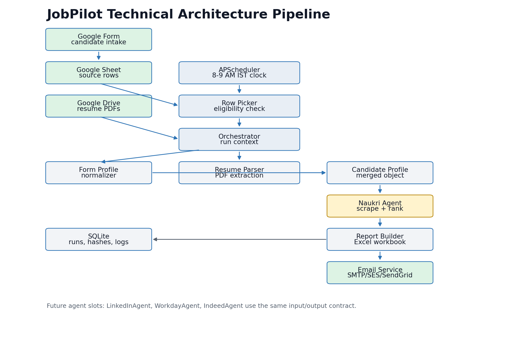
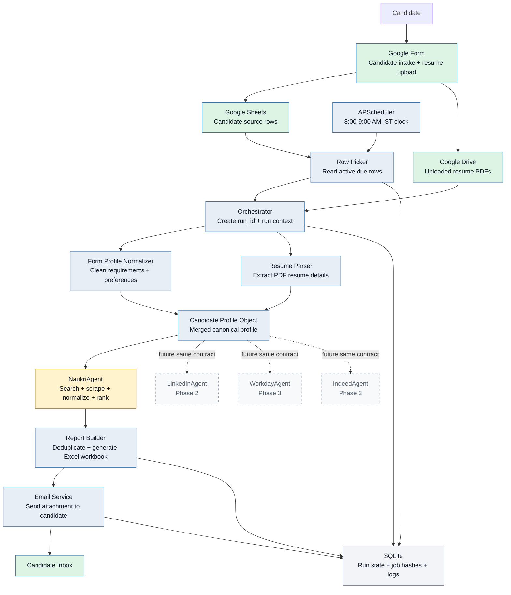
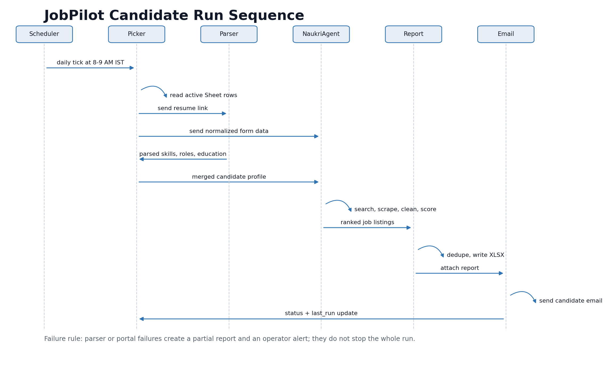
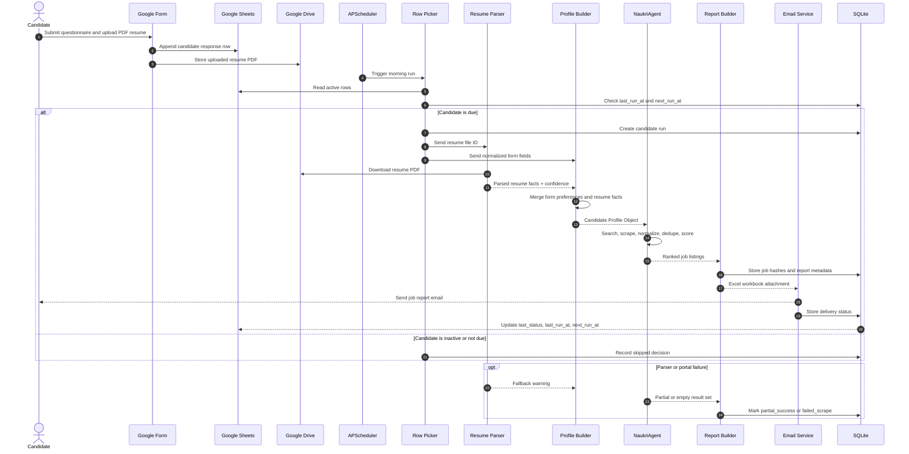
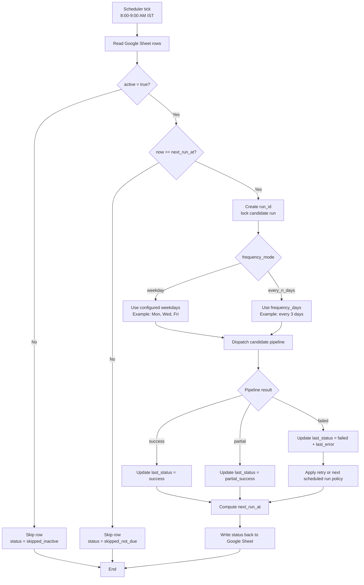

# JobPilot Technical Requirements Document

**Project:** Job Search Automation Platform  
**Document version:** 1.0 technical draft  
**Date:** 2026-06-19  
**Source inputs:** `Joblist v1.pdf` PRD draft and owner process-flow clarification  
**Capacity target:** 1-50 candidates maximum for the initial operating model  
**Initial portal:** Naukri first  
**Future portals:** LinkedIn, Workday, Indeed  
**Budget posture:** Use free services wherever practical. Paid spend should be limited to hosting or explicitly approved services.

## Related Artifacts

- [PDF TRD](artifacts/JobPilot_Technical_Requirements_Document.pdf)
- [Technical Architecture Pipeline](artifacts/JobPilot_Technical_Architecture_Pipeline.png)
- [Candidate Run Sequence Flow](artifacts/JobPilot_Run_Sequence_Flow.png)
- [Original PRD Draft](Joblist%20v1.pdf)

## 1. Executive Summary

JobPilot is a backend-only job discovery automation service. Candidates submit a Google Form once, upload a PDF resume, and then receive recurring Excel reports by email. The system reads candidate rows from Google Sheets, parses uploaded resumes from Google Drive, builds a merged candidate profile, runs portal-specific job discovery agents, ranks matching jobs, generates an Excel workbook, and emails the report to the candidate.

The MVP should be intentionally small. The original PRD mentioned a much larger concurrency target, but the current operating model is **1-50 candidates maximum**. This changes the architecture materially: the first version should use a single scheduled backend service, bounded concurrency, Google Workspace for intake and file storage, SQLite for operational metadata, and one production portal agent for Naukri.

## 2. Goals

- Reduce manual job-search effort for a small private user group.
- Accept candidate requirements through a non-technical Google Form.
- Parse resume PDFs and enrich candidate profile data.
- Search Naukri first using a dedicated scraping/ranking agent.
- Produce a clear Excel report with apply links and match context.
- Email reports on a predictable morning schedule.
- Keep implementation and infrastructure cost low.
- Preserve clean extension points for LinkedIn, Workday, and Indeed.

## 3. Non-Goals for MVP

- No auto-applying to jobs.
- No candidate-facing dashboard.
- No payment or subscription system.
- No public multi-tenant SaaS architecture.
- No complex distributed worker platform.
- No paid parsing or LLM API dependency unless explicitly approved.
- No production LinkedIn, Workday, or Indeed scraping until each portal has a compliance and technical review.

## 4. Capacity Adjustment

The PRD draft included a scalability target of 500 concurrent candidate pipelines. This TRD replaces that with a maximum of **1-50 active candidates**.

The practical implications are:

- Run only 1-3 candidate pipelines concurrently.
- Avoid launching many browser sessions at once.
- Use one always-on backend worker instead of a distributed queue in the MVP.
- Use SQLite for run metadata unless real usage proves a need for PostgreSQL.
- Keep observability simple: structured logs, status columns, and operator alerts.
- Add Celery, Redis, PostgreSQL, or queue workers only after the product outgrows the 1-50 candidate model.

## 5. High-Level Architecture



### Mermaid Architecture Diagram



### Core Components

| Component | Responsibility |
|---|---|
| Google Form | Candidate intake form and resume upload entry point. |
| Google Sheets | Stores one candidate response row per submission. |
| Google Drive | Stores uploaded resume PDFs. |
| Scheduler | Runs the backend picker at the configured morning time. |
| Row Picker | Reads Sheet rows, checks active status, and determines due candidates. |
| Orchestrator | Creates a run context and coordinates parsing, agent execution, reporting, and email. |
| Form Profile Normalizer | Converts raw Google Form fields into typed candidate preferences. |
| Resume Parser | Extracts skills, experience, education, projects, and contact details from PDF resumes. |
| Candidate Profile Object | Merged canonical profile consumed by job agents. |
| NaukriAgent | Builds search queries, scrapes Naukri listings, normalizes results, and ranks matches. |
| Report Builder | Creates an Excel workbook with job listings and summary sheets. |
| Email Service | Sends the Excel report to the candidate. |
| SQLite | Stores run metadata, job hashes, dedupe history, report history, and errors. |

## 6. Candidate Run Sequence



### Mermaid Sequence Diagram



### Detailed Flow

1. Candidate fills the Google Form and uploads a PDF resume.
2. Google Form writes a response row into Google Sheets.
3. Google Drive stores the uploaded resume file.
4. Scheduler triggers the backend row picker between 8:00 AM and 9:00 AM IST.
5. Row picker reads active candidate rows.
6. Row picker checks whether each candidate is due based on `next_run_at`, frequency mode, and active status.
7. Orchestrator creates a `run_id`.
8. Form Profile Normalizer processes Google Form fields.
9. Resume Parser downloads and extracts PDF content.
10. Profile merger builds the canonical Candidate Profile Object.
11. NaukriAgent builds query variants and scrapes matching listings.
12. NaukriAgent normalizes and scores jobs.
13. Report Builder deduplicates results and creates an Excel workbook.
14. Email Service sends the workbook to the candidate email address.
15. Backend updates `last_run_at`, `next_run_at`, `last_status`, and `last_error`.

Failure rule: parser or portal failures should create a partial report or operator alert where possible. A single failed agent must not corrupt the run state.

## 7. Recommended Low-Cost Stack

| Layer | MVP Choice | Reason |
|---|---|---|
| Language | Python 3.11+ | Strong ecosystem for scraping, Google integrations, PDF parsing, and Excel output. |
| Scheduler | APScheduler | Simple enough for one always-on backend service. |
| Intake | Google Forms + Google Sheets | Free or low-cost and easy for non-technical users. |
| File storage | Google Drive | Native Form upload storage; avoids storing resumes in the app DB. |
| Operational DB | SQLite | Sufficient for 1-50 candidates, run history, job hashes, and logs. |
| Scraping | Playwright + BeautifulSoup | Browser automation for dynamic pages, parser cleanup after load. |
| Resume parsing | pdfplumber or PyMuPDF | Free local parsing for text-first PDF resumes. |
| Report generation | pandas + openpyxl or xlsxwriter | Reliable Excel workbook generation. |
| Email | Gmail SMTP app password, SendGrid free tier, or AWS SES | Start simple; move to SES/SendGrid if deliverability becomes a problem. |
| Hosting | Low-cost VPS, Render, Railway, Fly.io, or similar | One always-on worker is enough for the MVP. |
| Config | `.env` and environment variables | Simple secrets/config management for a small deployment. |
| Logging | Python structured JSON logs | Easy troubleshooting without a heavy observability stack. |

## 8. Scheduling Requirements

The backend must support two scheduling modes:

1. **Weekday mode:** Monday, Wednesday, Friday.
2. **Every-N-days mode:** every 3 days, for example Monday, Thursday, Sunday, Wednesday.

### Recommended MVP Default

Use **Monday/Wednesday/Friday at 8:30 AM IST** as the default. Keep every-3-days support in the scheduler model, but start with one default cadence unless there is a clear candidate requirement.

### Scheduler Rules

| Requirement | MVP Behavior |
|---|---|
| Timezone | Use `Asia/Kolkata` for all schedule decisions. |
| Send window | 8:00 AM to 9:00 AM IST. Recommended default: 8:30 AM IST. |
| Candidate state | Only rows with `active = true` are eligible. |
| Frequency state | Use `frequency_mode`, `frequency_days`, `weekdays`, `last_run_at`, and `next_run_at`. |
| Missed runs | If the server was down, run due candidates on startup and recompute `next_run_at`. |
| Manual trigger | Allow an operator to trigger one candidate or all due candidates. |
| Concurrency | Process 1-3 candidates at a time. |
| Browser sessions | Cap active Playwright sessions to avoid memory spikes and portal blocking. |

### Mermaid Scheduler Decision Flow



## 9. Google Form Requirements

The Google Form should collect:

- Full name.
- Email address.
- Phone number.
- Current city or location.
- Preferred job locations.
- Current designation or job title.
- Years of experience.
- Skills.
- Preferred job roles or keywords.
- Expected salary.
- Notice period.
- Employment type preference.
- Target portals.
- Report frequency.
- Resume upload as PDF.
- Consent for resume parsing and automated job search.
- Optional active/pause preference.

### Recommended Future Form Fields

- Excluded companies.
- Preferred industries.
- Remote/hybrid/on-site preference.
- Work authorization.
- Job seniority.
- Maximum jobs per report.
- Whether previously sent jobs should be hidden or flagged.

## 10. Google Sheet Requirements

The Google Sheet is both the intake source and a lightweight operator surface.

| Column | Purpose |
|---|---|
| `candidate_id` | Stable generated ID. Do not depend only on row number. |
| `full_name` | Candidate name from Google Form. |
| `email` | Destination email for reports. |
| `phone` | Candidate phone number. |
| `current_location` | Current city/location. |
| `preferred_locations` | Target job locations. |
| `current_title` | Current role/designation. |
| `years_experience` | Candidate experience value. |
| `skills` | Form-submitted skills. |
| `preferred_roles` | Role keywords for job search. |
| `expected_salary` | Salary expectation. |
| `notice_period` | Notice period preference. |
| `employment_type` | Full-time, contract, remote, etc. |
| `target_portals` | Naukri initially; later LinkedIn, Workday, Indeed. |
| `resume_file_id` | Google Drive file ID extracted from uploaded resume link. |
| `active` | Whether the scheduler should process this candidate. |
| `frequency_mode` | `weekday` or `every_n_days`. |
| `weekdays` | Example: `Mon,Wed,Fri`. |
| `frequency_days` | Example: `3`. |
| `last_run_at` | Last attempted or completed run timestamp. |
| `next_run_at` | Next computed due timestamp. |
| `last_report_url` | Optional Google Drive link if reports are archived. |
| `last_status` | `success`, `partial_success`, `failed`, or `skipped`. |
| `last_error` | Short operator-facing error summary. |

## 11. SQLite Operational Database

Google Sheets should not be the only place where operational history lives. SQLite should store backend-owned state.

### Suggested Tables

#### `candidate_runs`

| Field | Purpose |
|---|---|
| `run_id` | Unique run identifier. |
| `candidate_id` | Candidate reference. |
| `trigger_type` | `scheduled`, `manual`, or `startup_recovery`. |
| `started_at` | Run start timestamp. |
| `completed_at` | Run completion timestamp. |
| `status` | Run status. |
| `jobs_found` | Total jobs found before filtering. |
| `jobs_reported` | Jobs included in final workbook. |
| `report_path` | Local or Drive path to generated report. |
| `error_summary` | Short error message if any. |

#### `job_history`

| Field | Purpose |
|---|---|
| `job_hash` | Stable dedupe key. |
| `candidate_id` | Candidate reference. |
| `source` | Portal name. |
| `job_title` | Normalized title. |
| `company` | Normalized company. |
| `location` | Normalized location. |
| `apply_url` | Apply link. |
| `first_seen_at` | First time this job was found. |
| `last_seen_at` | Last time this job was found. |
| `last_sent_at` | Last time this job was included in a report. |

#### `agent_runs`

| Field | Purpose |
|---|---|
| `agent_run_id` | Unique agent run ID. |
| `run_id` | Parent candidate run. |
| `agent_name` | Example: `NaukriAgent`. |
| `status` | Agent status. |
| `queries` | Search queries used. |
| `pages_visited` | Scraping depth. |
| `jobs_found` | Raw jobs found. |
| `jobs_retained` | Jobs after cleanup/filtering. |
| `error_summary` | Agent-level error. |

## 12. Candidate Profile Object

All agents should consume one merged object. Portal agents should not know about raw Google Sheets rows or Google Drive files.

```json
{
  "candidate_id": "cand_001",
  "identity": {
    "full_name": "Candidate Name",
    "email": "candidate@example.com",
    "phone": "9999999999",
    "current_location": "Bengaluru"
  },
  "preferences": {
    "target_roles": ["Data Analyst", "Business Analyst"],
    "preferred_locations": ["Bengaluru", "Remote"],
    "employment_type": "Full-time",
    "expected_salary": "12 LPA",
    "notice_period": "30 days",
    "target_portals": ["Naukri"]
  },
  "experience": {
    "years_experience": 3,
    "current_title": "Data Analyst",
    "past_roles": [],
    "companies": [],
    "seniority_guess": "mid"
  },
  "skills": {
    "skills_from_form": ["SQL", "Python", "Power BI"],
    "skills_from_resume": ["SQL", "Python", "Excel"],
    "normalized_skills": ["sql", "python", "power bi", "excel"],
    "must_have_keywords": ["data analyst", "sql"]
  },
  "resume": {
    "resume_file_id": "google_drive_file_id",
    "resume_text_hash": "sha256_hash",
    "parse_confidence": 0.86,
    "parsed_sections": {
      "summary": "",
      "experience": [],
      "education": [],
      "projects": [],
      "certifications": []
    }
  },
  "search_plan": {
    "query_variants": [],
    "location_variants": [],
    "filters": {},
    "max_jobs_per_run": 100
  }
}
```

### Conflict Rule

Form-submitted preferences are authoritative for:

- Target locations.
- Salary.
- Employment type.
- Notice period.
- Target roles.
- Portal selection.
- Report frequency.

Resume parsing may enrich skills, projects, and experience, but it should not override explicit candidate preferences without operator review.

## 13. Resume Parser Requirements

The Resume Parser should:

- Download the uploaded PDF from Google Drive.
- Extract text using a local PDF parser.
- Segment the resume into sections where possible.
- Extract name, email, phone, skills, experience, education, projects, and certifications.
- Generate a parser confidence score.
- Detect scanned or image-only resumes.
- Fall back to Google Form data when parsing is weak.
- Avoid permanent storage of raw resume text unless explicitly approved.

### Parser Failure Modes

| Failure | Required Behavior |
|---|---|
| PDF cannot be downloaded | Mark run as `failed_parse` unless form data is enough for a report. |
| PDF has no extractable text | Continue with form-only profile and flag low confidence. |
| Parser extracts conflicting identity data | Prefer Google Form identity fields. |
| Parser extracts noisy skills | Normalize and dedupe before ranking. |

## 14. NaukriAgent Requirements

Naukri is the first supported job portal.

### Input

The agent receives the Candidate Profile Object.

### Responsibilities

- Build query variants from target roles, skills, years of experience, and locations.
- Apply conservative rate limits.
- Scrape Naukri job search result pages.
- Extract normalized job records.
- Remove duplicates.
- Score each listing against the candidate profile.
- Return a structured list of ranked jobs.
- Log selector failures and page parsing errors.

### Job Listing Output

```json
{
  "job_title": "Data Analyst",
  "company_name": "Example Company",
  "location": "Bengaluru",
  "job_type": "Full-time",
  "experience_required": "2-5 years",
  "salary_range": "Not disclosed",
  "date_posted": "2026-06-19",
  "description_summary": "Short normalized summary",
  "application_url": "https://example.com/job",
  "source_portal": "Naukri",
  "match_score": 82,
  "match_reasons": ["Role match", "SQL skill match", "Location match"]
}
```

### NaukriAgent Limits

- Maximum jobs per candidate per run should be configurable.
- Recommended MVP limit: 50-100 jobs.
- Per-agent timeout: 5 minutes.
- Candidate pipeline target: complete within 10 minutes.
- Avoid account-based scraping unless explicitly reviewed.

## 15. Future Portal Agents

All future agents should use the same input and output contract as NaukriAgent.

| Agent | Phase | Notes |
|---|---|---|
| `LinkedInAgent` | Phase 2 | High compliance risk. Prefer official or user-authorized routes if available. |
| `WorkdayAgent` | Phase 3 | Workday is not one central job board; likely needs company career-site discovery. |
| `IndeedAgent` | Phase 3 | Review terms and available publisher/API options before scraping. |

## 16. Matching and Ranking

The MVP should use deterministic scoring first. An LLM can be added later for summarization or improved ranking, but it should not be required for the first release because of the low-budget constraint.

### Suggested Score Weights

| Criterion | Weight | Rule |
|---|---:|---|
| Role/title match | 30 | Keyword overlap between target roles and job title. |
| Skill match | 25 | Overlap between normalized skills and job title/description. |
| Location match | 20 | Preferred location match; remote handled separately. |
| Experience fit | 15 | Candidate years fit listed experience range or close tolerance. |
| Recency | 10 | Newer jobs rank higher. |

### Match Reason Examples

- Role keyword matched.
- Candidate has required skill.
- Preferred location matched.
- Remote role matched.
- Experience requirement fits candidate.
- Job posted recently.

## 17. Deduplication

Deduplication should happen at three levels:

### Within Portal

Use:

```text
normalized_title + normalized_company + normalized_location + apply_url
```

### Across Portals

Use:

```text
normalized_title + normalized_company + normalized_location
```

Add fuzzy matching later for small spelling variations.

### Across Runs

Store `job_hash` values in SQLite so previous jobs can be:

- Hidden from future reports.
- Included with a `Previously Sent` flag.
- Used to track recurring jobs.

This is an open product decision.

## 18. Excel Report Requirements

The system should generate an `.xlsx` workbook for each candidate run.

### Sheets

| Sheet | Purpose |
|---|---|
| `All Jobs` | Consolidated list of all reported jobs. |
| `Naukri` | Naukri-specific results. |
| `Run Summary` | Candidate name, run timestamp, query list, job counts, and warnings. |

### Columns

Recommended `All Jobs` columns:

- Rank.
- Match Score.
- Job Title.
- Company.
- Location.
- Experience.
- Salary.
- Type.
- Posted Date.
- Source.
- Apply Link.
- Match Reasons.
- Notes.

### Formatting Requirements

- Apply links should be clickable.
- Header row should be frozen.
- Columns should be auto-sized where practical.
- Match score should be sortable.
- New/previously-sent status should be visible if cross-run dedupe is enabled.

## 19. Email Delivery Requirements

The Email Service should:

- Send the report to the email from the Google Form.
- Attach the generated Excel workbook.
- Include total jobs found and reported.
- Mention the source portal count.
- Include generation date and time.
- Include a short disclaimer that listings should be verified before applying.
- Retry transient failures up to 3 times.
- Mark permanent failures as `failed_email`.

### Suggested Subject

```text
JobPilot Report - <Candidate Name> - <YYYY-MM-DD>
```

### Suggested Body

```text
Hi <Candidate Name>,

Your JobPilot report is ready.

Total jobs included: <count>
Source: Naukri
Generated at: <timestamp>

Please verify job details on the original job page before applying.

Regards,
JobPilot
```

## 20. Deployment Architecture

For 1-50 users, the recommended deployment is a single always-on backend process.

### Recommended MVP Deployment

- One low-cost VPS or always-on worker service.
- Python backend process with APScheduler.
- SQLite database on persistent disk.
- Daily SQLite backup.
- Google service account credentials stored as hosting secrets.
- SMTP or email-provider credentials stored as hosting secrets.
- Playwright browser dependencies installed during deployment.
- Health check or heartbeat log reviewed by the operator.

### Hosting Options

| Option | Cost Profile | Fit |
|---|---|---|
| Low-cost VPS | Low paid | Best control for Playwright browsers and scheduled background runs. |
| Render/Railway/Fly worker | Free to low paid | Easy deployment; must confirm sleep/always-on behavior. |
| GCP Cloud Run scheduled job | Low if usage is small | Good for stateless jobs, but browser scraping may need tuning. |
| GitHub Actions cron | Free/limited | Good for prototypes; weaker for long browser runs, secrets, and reliability. |

### Recommendation

Use a low-cost VPS or a confirmed always-on worker. Avoid sleeping free services for scheduled morning reports.

## 21. Security and Privacy Requirements

### Secrets

- Do not commit credentials.
- Store secrets in environment variables or hosting secret manager.
- Rotate credentials if accidentally exposed.
- Use separate development and production credentials if possible.

### Google Access

- Use a Google service account.
- Grant access only to the specific Sheet and Drive folder.
- Do not grant broad Drive access.
- Store only the Drive file ID in backend metadata.

### Resume Data

- Keep original resumes in Google Drive.
- Do not store raw resume text permanently by default.
- Store only parse metadata, file ID, and hashes unless explicit retention is approved.

### Logs

- Mask email and phone values where possible.
- Do not log full resume text.
- Log short error summaries and run IDs.

### Candidate Consent

The Google Form should include consent for:

- Resume parsing.
- Automated job search.
- Email report delivery.
- Storing operational metadata.

### Pause/Unsubscribe

The MVP should provide at least one pause mechanism:

- `active = false` in the Google Sheet, managed by operator.
- Later: a second Google Form for update/pause requests.

## 22. Portal Compliance Requirement

Do not encode "scraping is allowed" as a blanket technical assumption.

Each portal agent must include:

- Compliance note.
- Rate-limit policy.
- Disable switch.
- Scraping method.
- Data fields collected.
- Maintenance owner.

LinkedIn should be treated as high risk. Public LinkedIn terms include restrictions against bots, scraping, and automated access, so LinkedIn should not be treated the same as Naukri without legal/product review.

Naukri should still use conservative scraping behavior and should be reviewed against current terms before production launch.

## 23. Observability and Operations

### Run Statuses

| Status | Meaning |
|---|---|
| `queued` | Candidate selected and waiting for processing. |
| `running` | Profile building or portal work is active. |
| `success` | Report generated and email sent. |
| `partial_success` | At least one non-critical step failed but a report was sent. |
| `failed_parse` | Resume could not be parsed and form fallback was insufficient. |
| `failed_scrape` | Portal agent failed and no reportable jobs were available. |
| `failed_email` | Report generated but email delivery failed. |
| `skipped` | Candidate was not due or inactive. |

### Required Logs

Each run should log:

- `run_id`.
- `candidate_id`.
- `trigger_type`.
- `started_at`.
- `completed_at`.
- `status`.
- Parser status.
- Parse confidence.
- Query variants.
- Pages visited.
- Jobs found.
- Jobs retained.
- Report path.
- Email delivery status.
- Error class.
- Error summary.

### Operator Commands

The backend should support:

- Run one candidate by `candidate_id`.
- Run all due candidates.
- Dry-run one candidate without sending email.
- Regenerate the last report.
- Resend the last report.
- Pause or unpause a candidate.

These can be CLI commands in the MVP. A secured admin API can be added later.

## 24. Manual Trigger Requirements

Minimum acceptable manual trigger interface:

```bash
python -m jobpilot run-candidate --candidate-id cand_001
python -m jobpilot run-due
python -m jobpilot dry-run --candidate-id cand_001
python -m jobpilot resend-last-report --candidate-id cand_001
```

Future secured HTTP API:

```http
POST /trigger/candidate/{candidate_id}
POST /trigger/all-due
POST /trigger/dry-run/{candidate_id}
```

Admin endpoints must require an API key or equivalent authentication.

## 25. Non-Functional Requirements

| Category | Requirement |
|---|---|
| Capacity | Support 1-50 active candidates. |
| Concurrency | Process 1-3 candidates concurrently. |
| Performance | Naukri-only candidate run should complete within 10 minutes. |
| Reliability | Portal failures should not corrupt run state. |
| Maintainability | Each portal agent must be isolated behind a common interface. |
| Security | No secrets in source code. |
| Privacy | Resume files remain in Google Drive by default. |
| Cost | No paid APIs in MVP unless explicitly approved. |
| Operability | Operator can identify failed runs and rerun candidates. |

## 26. Error Handling Requirements

| Error Scenario | Required Behavior |
|---|---|
| Google Sheet unavailable | Retry, then fail run with operator alert. |
| Resume file missing | Use form data if sufficient; otherwise mark `failed_parse`. |
| Resume parse low confidence | Continue with form fallback and include warning in run summary. |
| Naukri layout changed | Mark agent failure, log selector, and alert operator. |
| No jobs found | Send report with empty state or mark no-results success. |
| Email failure | Retry up to 3 times, then mark `failed_email`. |
| Server restart mid-run | Use run state to avoid duplicate emails where possible. |

## 27. Implementation Phases

| Phase | Deliverable | Exit Criteria |
|---|---|---|
| 0 | Local prototype | Read sample Sheet row, parse sample PDF, create dummy Excel, send test email. |
| 1 | Google integration | Service account reads Sheet and Drive uploads reliably. |
| 2 | Profile builder | Candidate Profile Object generated with parser fallback and validation. |
| 3 | Naukri MVP agent | Scrapes and ranks listings for 3-5 test profiles without manual intervention. |
| 4 | Scheduler and reports | Morning scheduled run sends Excel reports and updates run state. |
| 5 | Hardening | Retries, logs, dedupe history, pause controls, and operator commands. |
| 6 | Portal expansion | Add LinkedIn, Workday, and Indeed only after compliance and selector strategy review. |

## 28. Key Risks and Mitigations

| Risk | Mitigation |
|---|---|
| Portal layout changes break scraping | Isolate selectors per portal and log selector failures clearly. |
| Portal blocks automated access | Use conservative rates, disable switches, and compliance review. |
| Resume is scanned/image-only | Detect low text extraction and fallback to form data. |
| Google API quota/auth issue | Batch reads, cache per run, and alert operator. |
| Email lands in spam | Use verified sender and move to SES/SendGrid if needed. |
| Candidate receives repeated jobs | Store job hashes and suppress or flag previously sent jobs. |
| Server sleeps during schedule | Use always-on hosting. |
| Costs increase unexpectedly | Keep LLMs and paid APIs out of MVP by default. |

## 29. Open Decisions

These decisions should be resolved before implementation hardening:

- Should the default cadence be Monday/Wednesday/Friday or every three days?
- What is the maximum number of jobs per report: 50, 100, or another value?
- Should previously sent jobs be hidden or shown with a `Previously Sent` flag?
- Should candidates be able to update or pause through a second Google Form?
- Should salary be a hard filter or a soft scoring preference?
- Should generated reports be archived in Google Drive?
- What is the acceptable maintenance frequency for portal scraper fixes?
- Will an LLM be allowed later for job-description summarization or ranking?
- If LLM use is allowed later, what is the budget cap?

## 30. Acceptance Criteria

The MVP is acceptable when:

- A new Google Form submission appears in the Sheet and can be picked up by the backend.
- Backend can download the uploaded PDF resume.
- Backend can generate a Candidate Profile Object.
- Scheduler can process due active candidates at the configured morning time.
- NaukriAgent returns normalized job listings with apply links for a test candidate.
- Excel report includes `All Jobs`, `Naukri`, and `Run Summary` sheets.
- Candidate receives the report by email with correct attachment.
- Backend records `last_run_at`, `next_run_at`, `last_status`, and `last_error`.
- Naukri scraping failure is logged clearly.
- Failed portal work does not corrupt candidate state.
- No secrets are committed to the repository.
- The system handles 50 candidates by bounded batching rather than excessive parallel browser sessions.

## 31. Recommended MVP Build Order

1. Create repository structure and configuration model.
2. Implement Google Sheets reader.
3. Implement Google Drive resume downloader.
4. Implement Candidate Profile Object schema.
5. Implement PDF resume parser.
6. Implement form-data normalizer.
7. Implement profile merger.
8. Implement dummy job agent returning mock jobs.
9. Implement Excel report generator.
10. Implement email sender.
11. Implement SQLite run metadata.
12. Implement APScheduler schedule.
13. Replace dummy job agent with NaukriAgent.
14. Add dedupe history.
15. Add operator CLI commands.
16. Add deployment configuration.
17. Add logging and failure alerts.

## 32. Proposed Repository Structure

```text
jobpilot/
  app/
    __init__.py
    config.py
    scheduler.py
    orchestrator.py
    models.py
    google_sheets.py
    google_drive.py
    resume_parser.py
    profile_builder.py
    report_builder.py
    emailer.py
    db.py
    logging_config.py
    agents/
      __init__.py
      base.py
      naukri.py
      linkedin.py
      workday.py
      indeed.py
  scripts/
    run_candidate.py
    run_due.py
  tests/
    test_profile_builder.py
    test_resume_parser.py
    test_report_builder.py
    test_scheduler.py
  .env.example
  requirements.txt
  README.md
```

## 33. Environment Variables

```text
APP_ENV=development
TIMEZONE=Asia/Kolkata
DEFAULT_SCHEDULE_TIME=08:30
DEFAULT_WEEKDAYS=Mon,Wed,Fri
MAX_CONCURRENT_CANDIDATES=3
MAX_JOBS_PER_PORTAL=100

GOOGLE_SERVICE_ACCOUNT_JSON_PATH=
GOOGLE_SHEET_ID=
GOOGLE_RESUME_FOLDER_ID=

SMTP_HOST=
SMTP_PORT=
SMTP_USERNAME=
SMTP_PASSWORD=
SMTP_FROM_EMAIL=

DATABASE_URL=sqlite:///jobpilot.sqlite3
REPORT_OUTPUT_DIR=reports
LOG_LEVEL=INFO
```

## 34. Testing Requirements

### Unit Tests

- Profile normalization.
- Resume parser fallback behavior.
- Candidate Profile Object validation.
- Scheduler eligibility calculations.
- Job dedupe hash generation.
- Match score calculation.
- Excel workbook generation.

### Integration Tests

- Read sample Google Sheet row.
- Download test resume from Drive.
- Parse sample PDF.
- Generate Excel report.
- Send email to a test inbox.

### Manual QA

- Confirm candidate receives email.
- Confirm Excel links open.
- Confirm job titles and companies are readable.
- Confirm duplicate jobs are removed.
- Confirm `last_run_at` and `next_run_at` update correctly.
- Confirm paused candidates are skipped.

## 35. Launch Checklist

- Google Form finalized.
- Consent text added.
- Google Sheet columns added.
- Google service account created.
- Service account granted least-privilege Sheet/Drive access.
- Hosting selected.
- Secrets configured.
- Test email provider configured.
- SQLite persistent storage configured.
- Daily backup configured.
- NaukriAgent tested with sample candidates.
- Operator manual trigger documented.
- Failure logs reviewed.
- First live run performed with one internal candidate.

## 36. Source Notes

This Markdown TRD is derived from:

- `Joblist v1.pdf`, PRD draft dated 2026-06-18.
- Owner process-flow clarification provided on 2026-06-19.
- Generated TRD PDF and diagram artifacts in `artifacts/`.

Portal terms and scraping rules can change. They should be reviewed again before production launch.
