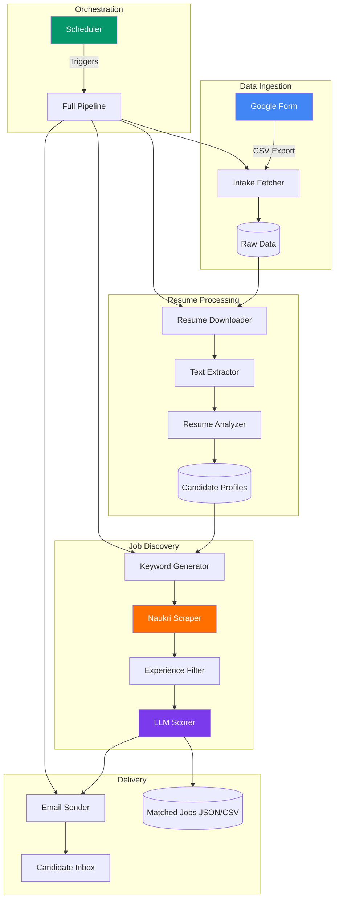
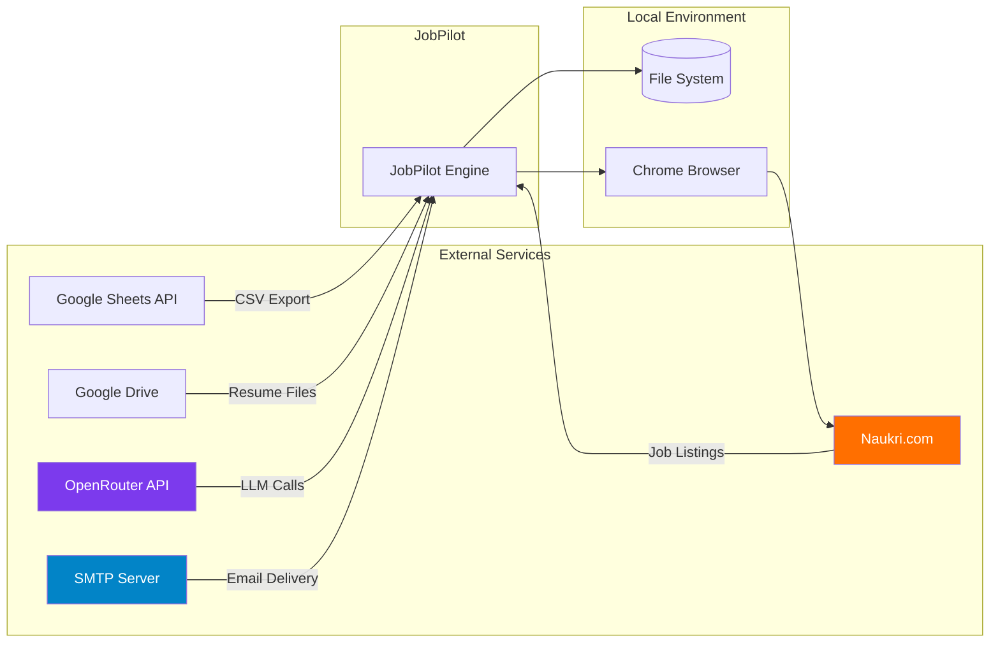
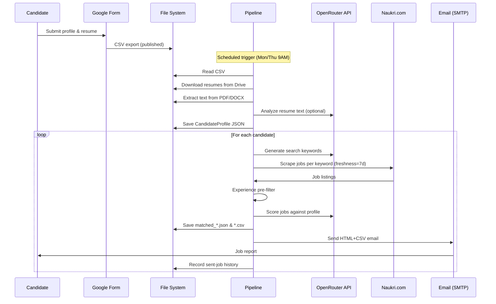
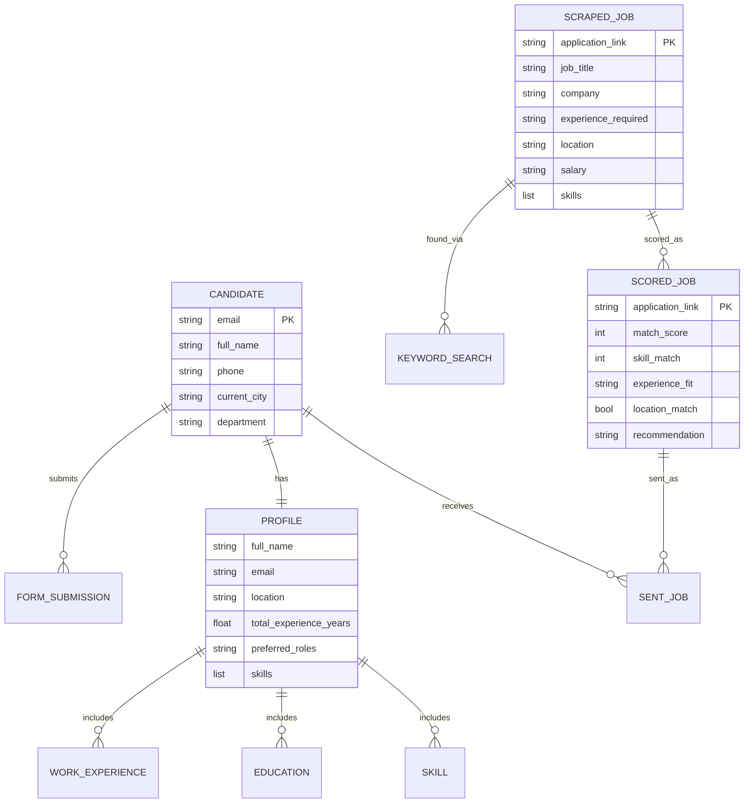
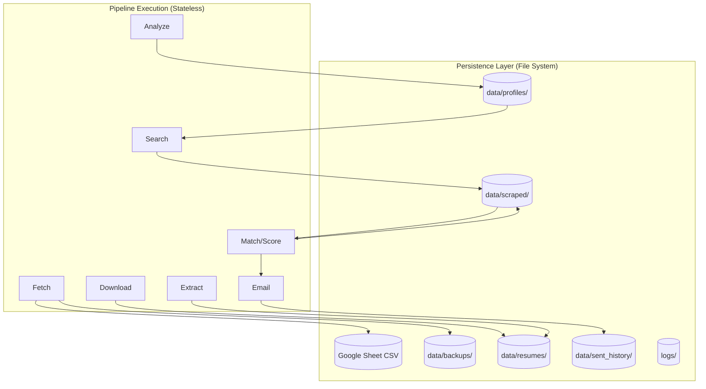
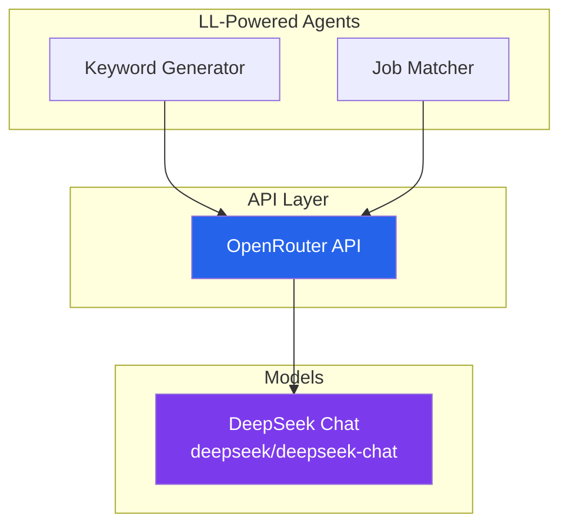
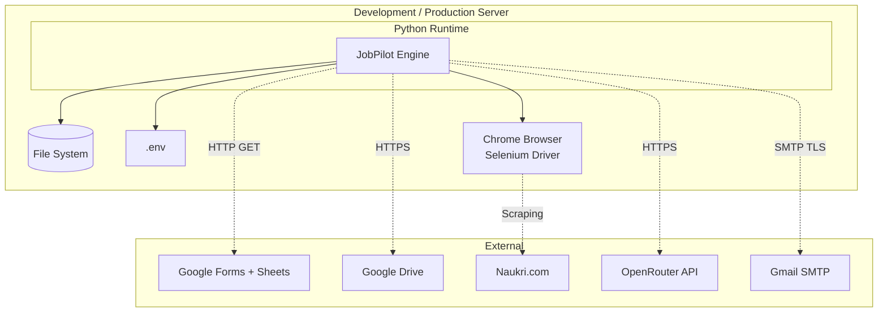
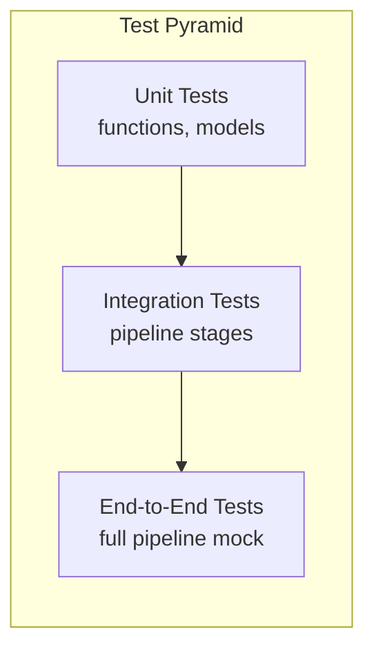

# JobPilot — Software Design Document

> **Version:** 1.0  
> **Date:** June 22, 2026  
> **Author:** JobPilot Engineering Team  
> **Status:** Internal — Production Grade

---

## Table of Contents

1. [Executive Summary](#1-executive-summary)
2. [High-Level System Overview](#2-high-level-system-overview)
3. [Repository Structure](#3-repository-structure)
4. [Technology Stack](#4-technology-stack)
5. [Application Flow](#5-application-flow)
6. [Deep File-Level Analysis](#6-deep-file-level-analysis)
7. [Data Structures](#7-data-structures)
8. [Database Design](#8-database-design)
9. [API Documentation](#9-api-documentation)
10. [Internal Business Logic](#10-internal-business-logic)
11. [State Management](#11-state-management)
12. [Authentication and Authorization](#12-authentication-and-authorization)
13. [AI and ML Components](#13-ai-and-ml-components)
14. [Error Handling](#14-error-handling)
15. [Performance Analysis](#15-performance-analysis)
16. [Security Analysis](#16-security-analysis)
17. [External Integrations](#17-external-integrations)
18. [Configuration](#18-configuration)
19. [Deployment Architecture](#19-deployment-architecture)
20. [Logging and Monitoring](#20-logging-and-monitoring)
21. [Testing](#21-testing)
22. [Known Limitations](#22-known-limitations)
23. [Future Improvements](#23-future-improvements)
24. [Glossary](#24-glossary)
25. [Appendix](#25-appendix)

---

## 1. Executive Summary

### What Problem Does JobPilot Solve?

**JobPilot** is an automated job-matching system that connects job seekers with relevant job listings from Naukri.com — India's largest job portal. The system eliminates the manual, time-consuming process of searching for jobs and applying to each one individually.

### Who Are the Target Users?

| Persona | Description |
|---------|-------------|
| **Job Seekers** | Individuals actively looking for employment who submit their details via a Google Form |
| **Recruitment Coordinators** | Staff who manage the job-matching pipeline and monitor results |
| **System Administrators** | Technical staff who deploy, configure, and maintain the system |

### Business Use Cases

1. **Automated Job Discovery**: Job seekers submit their resumes and preferences once; JobPilot continuously searches for matching opportunities.
2. **AI-Powered Matching**: Machine learning (via LLMs) scores each job against the candidate's profile, skills, experience, and location preferences.
3. **Weekly Digests**: Candidates receive email reports with ranked job matches, including match scores, missing skills, and application links.
4. **Freshness Filtering**: Only jobs posted within the last 7 days are considered, ensuring candidates see timely, actionable listings.

### Main Capabilities

- **Intake Management**: Fetch and store candidate responses from Google Forms (CSV export).
- **Resume Parsing**: Download resumes from Google Drive, extract text, and structure the data using rule-based or LLM-powered analysis.
- **Search Keyword Generation**: Use an LLM to derive optimal search queries from a candidate's profile, skills, and preferred roles.
- **Web Scraping**: Use Selenium with a real Chrome browser to scrape Naukri.com (bypasses Akamai CDN protections).
- **Experience Filtering**: Hard-filter jobs by experience requirements before LLM scoring to reduce cost and improve accuracy.
- **LLM Scoring**: Score each job against the candidate profile on skills match, experience fit, location match, and overall relevance.
- **Email Delivery**: Send HTML-formatted reports with CSV attachments containing ranked job listings.
- **Sent-Job History**: Track which jobs have already been emailed to each candidate to avoid duplicates.
- **Scheduler**: Automate the full pipeline on a weekly calendar (default: Monday & Thursday at 9 AM).

### Core Workflow

```
Google Form → CSV Fetch → Resume Download → Text Extraction →
Profile Analysis → Keyword Generation → Naukri Scraping →
Experience Filter → LLM Scoring → Email Report
```

### Overall Purpose

JobPilot is designed to be a **self-service recruitment automation platform** that reduces the time from candidate registration to job application from days to minutes. It runs on a scheduled basis, processes batches of candidates, and delivers personalized job recommendations via email — all without human intervention.

---

## 2. High-Level System Overview

### Major Components



### Internal Services

| Service | Location | Role |
|---------|----------|------|
| **Intake Fetcher** | `src/jobpilot/intake/fetcher.py` | Fetches candidate data from Google Sheets CSV |
| **Resume Downloader** | `src/jobpilot/parser/downloader.py` | Downloads files from Google Drive links |
| **Text Extractor** | `src/jobpilot/parser/extractor.py` | Extracts text from PDF/DOCX resumes |
| **Resume Analyzer** | `src/jobpilot/parser/analyzer.py` | Parses resume text into structured data |
| **Profile Builder** | `src/jobpilot/parser/pipeline.py` | Orchestrates intake → analysis → profile JSON |
| **Keyword Generator** | `src/jobpilot/scraper/keyword_gen.py` | LLM-based search keyword generation |
| **Naukri Scraper** | `src/jobpilot/scraper/naukri_scraper.py` | Selenium-based web scraper |
| **Experience Filter** | `src/jobpilot/scraper/experience_filter.py` | Hard-filters jobs by experience |
| **Job Matcher** | `src/jobpilot/scraper/job_matcher.py` | LLM-based job scoring |
| **Email Sender** | `src/jobpilot/scraper/email_sender.py` | SMTP email delivery |
| **Sent History** | `src/jobpilot/scraper/sent_history.py` | Dedup tracking of sent jobs |
| **Search Agent** | `src/jobpilot/scraper/search_agent.py` | Orchestrates keyword→scrape→filter→score→email |
| **Scheduler** | `scripts/run_scheduler.py` | Calendar-based pipeline trigger |

### External Dependencies



### How Users Interact

1. **Job Seekers** — Fill a Google Form with personal details, resume upload, and job preferences. After that, they receive email reports passively.
2. **Administrators** — Use CLI scripts (`scripts/run_scheduler.py --once`, `scripts/search_jobs.py --name "..."`) to trigger runs manually or set up a 24/7 daemon.
3. **The system has no user-facing frontend or API** — it's a batch-processing pipeline that runs on a schedule.

---

## 3. Repository Structure

### Top-Level Layout

```
D:\Joblist/
├── .env                        # Environment variables (secrets, API keys)
├── .gitignore                  # Git ignore rules
├── README.md                   # Project overview
├── requirements.txt            # Python dependencies
├── config/                     # Application configuration
│   ├── __init__.py
│   └── settings.py             # Settings loader (.env → dict)
├── scripts/                    # CLI entry points
│   ├── fetch_intake.py         # Phase 1: fetch form data
│   ├── parse_resumes.py        # Phase 2: parse resumes
│   ├── search_jobs.py          # Phase 3: search + score + email
│   ├── run_scheduler.py        # Full pipeline scheduler
│   ├── scrape_jobs.py          # Direct scraper entry point
│   └── resend_emails.py        # Re-send from saved files
├── src/jobpilot/               # Core application code
│   ├── __init__.py
│   ├── intake/                 # Data ingestion
│   │   ├── __init__.py
│   │   └── fetcher.py          # Google Sheet CSV fetcher
│   ├── parser/                 # Resume parsing pipeline
│   │   ├── __init__.py
│   │   ├── models.py           # Data models (CandidateProfile, ParsedResume)
│   │   ├── downloader.py       # Google Drive downloader
│   │   ├── extractor.py        # PDF/DOCX text extraction
│   │   ├── analyzer.py         # Resume text → structured data
│   │   └── pipeline.py         # Orchestrates parser pipeline
│   ├── scraper/                # Job scraping & matching
│   │   ├── __init__.py
│   │   ├── naukri_scraper.py   # Selenium-based Naukri scraper
│   │   ├── keyword_gen.py      # LLM keyword generation
│   │   ├── search_agent.py     # Full search orchestration
│   │   ├── experience_filter.py # Experience pre-filter
│   │   ├── job_matcher.py      # LLM job scoring
│   │   ├── llm_client.py       # OpenRouter API client
│   │   ├── email_sender.py     # SMTP email delivery
│   │   └── sent_history.py     # Dedup tracking
│   └── utils/                  # Utilities
│       └── __init__.py
├── data/                       # Runtime data directories
│   ├── profiles/               # Candidate profile JSONs
│   ├── scraped/                # Scraped job CSVs/JSONs
│   ├── resumes/                # Downloaded resume files
│   ├── sent_history/           # Sent-job tracking files
│   └── backups/                # Intake CSV backups
├── logs/                       # Pipeline logs
│   ├── scheduler.json          # Run history
│   └── calendar_cache.json     # Next scheduled run
├── tests/                      # Test suite
│   ├── __init__.py
│   ├── test_dedup.py           # Deduplication tests
│   └── test_intake.py          # Intake tests
└── pdfs/                       # Generated documentation
    ├── README.md
    └── JobPilot_Design_Document.md
```

### Detailed File Table

| File | Responsibility | Used By | Dependencies |
|------|---------------|---------|-------------|
| `config/settings.py` | Load `.env`, expose settings dict | All modules | `python-dotenv`, `os` |
| `src/jobpilot/intake/fetcher.py` | Fetch Google Sheet CSV, show summary, save backup | `scripts/fetch_intake.py`, `parser/pipeline.py` | `pandas`, `os` |
| `src/jobpilot/parser/models.py` | Data classes for profiles and parsed resumes | `parser/`, `scraper/` | `dataclasses` |
| `src/jobpilot/parser/downloader.py` | Download from Google Drive links | `parser/pipeline.py` | `requests`, `gdown` |
| `src/jobpilot/parser/extractor.py` | Extract text from PDF/DOCX | `parser/pipeline.py` | `pdfminer`, `python-docx` |
| `src/jobpilot/parser/analyzer.py` | Parse resume text → structured data | `parser/pipeline.py` | `re`, `json` |
| `src/jobpilot/parser/pipeline.py` | Orchestrate intake→download→extract→analyze→save | `scripts/run_scheduler.py` | All parser modules |
| `src/jobpilot/scraper/llm_client.py` | OpenRouter API client with retries | `keyword_gen.py`, `job_matcher.py` | `openai` SDK |
| `src/jobpilot/scraper/keyword_gen.py` | LLM generates search keywords from profile | `search_agent.py` | `llm_client.py` |
| `src/jobpilot/scraper/naukri_scraper.py` | Selenium Chrome scraper for Naukri | `search_agent.py` | `selenium` |
| `src/jobpilot/scraper/experience_filter.py` | Filter jobs by experience range | `search_agent.py` | `re` |
| `src/jobpilot/scraper/job_matcher.py` | LLM scores jobs against profiles | `search_agent.py` | `llm_client.py` |
| `src/jobpilot/scraper/search_agent.py` | Orchestrate keyword→scrape→filter→score→email | `scripts/search_jobs.py`, `scripts/run_scheduler.py` | All scraper modules |
| `src/jobpilot/scraper/email_sender.py` | Send HTML+CSV email via SMTP | `search_agent.py` | `smtplib`, `email` |
| `src/jobpilot/scraper/sent_history.py` | Track/check sent jobs by (email, link) | `search_agent.py` | `json`, `os` |
| `scripts/run_scheduler.py` | Full pipeline daemon with calendar | Direct CLI | All modules |
| `scripts/search_jobs.py` | Phase 3 CLI with flags | Direct CLI | `search_agent.py` |
| `scripts/resend_emails.py` | Re-send from saved matched JSON | Direct CLI | `email_sender.py`, `sent_history.py` |

---

## 4. Technology Stack

### Backend

| Technology | Version | Purpose | Why Chosen |
|-----------|---------|---------|------------|
| **Python** | 3.11+ | Primary runtime | Rich ecosystem for data processing, LLMs, web scraping |
| **OpenRouter API** | — | LLM-as-a-service | Single API for multiple models; fallback support |
| **DeepSeek Chat** | deepseek/deepseek-chat | Default LLM model | Cost-effective, good reasoning, large context window |
| **Selenium** | 4.x | Web scraping | Naukri uses Akamai CDN that blocks headless browsers and simple HTTP clients |
| **SMTP (Gmail)** | — | Email delivery | Ubiquitous, supports App Passwords for 2FA accounts |

### Data Processing

| Technology | Purpose |
|-----------|---------|
| **pandas** | CSV parsing, DataFrame operations |
| **pdfminer.six** | PDF text extraction from resumes |
| **python-docx** | DOCX text extraction from resumes |
| **gdown** | Google Drive file downloading |

### Infrastructure

| Component | Technology | Details |
|-----------|-----------|---------|
| **Configuration** | `.env` + `python-dotenv` | Environment-based secrets management |
| **File Storage** | Local filesystem | JSON profiles, CSV/JSON jobs, text logs |
| **Scheduling** | Python loop + cron expressions | In-process daemon; no external scheduler needed |
| **No Database** | Filesystem-based | All state is flat files (JSON, CSV, TXT) — suitable for batch processing |

### Why Not...

| Alternative | Reason NOT Chosen |
|------------|-------------------|
| **Django / FastAPI** | No HTTP API needed — pure batch processing |
| **PostgreSQL / MongoDB** | Overkill for a batch pipeline; JSON files are sufficient |
| **Scrapy** | Naukri blocks bot user-agents; Selenium's real browser is required |
| **Requests / httpx** | Cannot bypass Akamai CDN — only Selenium works |
| **CrewAI / LangChain** | Only 2 LLM calls per candidate; framework overhead not justified |
| **Docker** | Not yet required; can be containerized later |

---

## 5. Application Flow

### End-to-End Pipeline



### Step-by-Step User Journey

#### 1. Registration (Manual — Google Form)

A job seeker fills out a Google Form with:
- **Personal info**: Name, email, phone
- **Professional info**: Current job title, company, experience, notice period
- **Preferences**: Preferred roles, locations, employment type, work mode, seniority level
- **Consent options**: Resume parsing, automated job search, email delivery
- **Resume upload**: PDF/DOCX file uploaded to Google Drive

#### 2. Scheduled Pipeline Trigger

The scheduler (`scripts/run_scheduler.py`) runs as either:
- A **24/7 daemon** that checks the calendar every 60 seconds
- A **one-shot run** with `--once` for testing

On trigger, it calls `_execute_full_pipeline()` which orchestrates all phases.

#### 3. Data Fetching (Phase 1)

`pipeline.py` → `fetcher.py` reads the published Google Sheet CSV URL. The CSV contains all form responses. Each row becomes a `CandidateProfile` object.

#### 4. Resume Processing (Phase 2)

For each candidate who consented to resume parsing:

```python
# Pseudocode of the flow
resume_path = download_resume(drive_link)       # gdown
text = extract_text(resume_path)                # pdfminer / python-docx
parsed = analyze_resume(text)                   # Regex-based parsing
profile.parsed_resume = parsed                  # Merge into profile
profile_json = profile.combine()                # Flat dict for downstream
save_json(profile_json)                         # data/profiles/profile_*.json
```

#### 5. Job Search (Phase 3)

For each candidate profile:

```
                           ┌──────────────────┐
                           │  Candidate Profile │
                           └────────┬─────────┘
                                    │
                                    ▼
                           ┌──────────────────┐
                           │  Generate Keywords│  ← LLM call #1
                           │  (manager, team   │
                           │   lead, senior... │
                           └────────┬─────────┘
                                    │
                    ┌───────────────┼───────────────┐
                    ▼               ▼               ▼
           ┌──────────────┐ ┌──────────────┐ ┌──────────────┐
           │ Scrape kw #1  │ │ Scrape kw #2  │ │ Scrape kw #3  │
           │ freshness=7d  │ │ freshness=7d  │ │ freshness=7d  │
           │ 20 jobs/page  │ │ 20 jobs/page  │ │ 20 jobs/page  │
           └──────┬───────┘ └──────┬───────┘ └──────┬───────┘
                  │                │                │
                  └────────────────┼────────────────┘
                                   ▼
                          ┌──────────────────┐
                          │  Dedup by link    │
                          └────────┬─────────┘
                                   │
                                   ▼
                          ┌──────────────────┐
                          │ Experience Filter │  ← Hard filter rules
                          │ X yrs ± tolerance │
                          └────────┬─────────┘
                                   │
                                   ▼
                          ┌──────────────────┐
                          │  LLM Score Jobs   │  ← LLM call #2 (batched)
                          │  skill_match,     │
                          │  experience_fit,  │
                          │  location_match   │
                          └────────┬─────────┘
                                   │
                                   ▼
                          ┌──────────────────┐
                          │ Save & Email      │
                          │ matched_*.json    │
                          │ matched_*.csv     │
                          └──────────────────┘
```

#### 6. Email Delivery

For each candidate:
- Check sent history for already-emailed jobs
- Build HTML email with personalized greeting, job count, and CTA
- Attach CSV with full ranked job list (title, company, score, missing skills, link)
- Send via SMTP (Gmail App Password)
- Record sent jobs to dedup file

---

## 6. Deep File-Level Analysis

### 6.1 `src/jobpilot/scraper/naukri_scraper.py`

**Purpose:** The heart of the job discovery pipeline. Uses Selenium Chrome to scrape Naukri.com job listings by keyword.

**Functions:**

| Function | Parameters | Returns | Side Effects |
|----------|-----------|---------|-------------|
| `_sanitize_filename(s)` | `s: str` | Clean filename string | None |
| `_job_tuple_script()` | None | JS string | None (returns JS, not executed) |
| `_get_next_page_button_script()` | None | JS string | None |
| `_create_driver()` | None | `webdriver.Chrome` | Opens Chrome window |
| `_navigate_to_search(driver, keyword, page, freshness_days)` | Driver, keyword, page, freshness | Navigated URL | Mutates browser state |
| `scrape_naukri(keyword, max_pages, freshness_days, output_dir)` | Keyword, pages, freshness, output | `list[dict]` jobs | Saves CSV+JSON to disk |
| `_write_csv(path, rows)` | Path, rows | None | Writes CSV file |

**Key Design Decisions:**

1. **Visible Chrome, not headless**: Naukri uses Akamai CDN that actively blocks headless browsers. A visible window is required.
2. **Stealth patches**: The driver removes automation flags (`navigator.webdriver`, `enable-automation`) and sets realistic user-agent and languages.
3. **Home page warm-up**: Visiting Naukri's home page first establishes cookies/Akamai clearance before attempting search URLs.
4. **JavaScript extraction**: Job cards are extracted via `document.querySelectorAll('.srp-jobtuple-wrapper')` — this relies on Naukri's current DOM structure, which may change.
5. **Freshness filter**: URLs include `?freshness=7` by default, showing only jobs posted in the last week.

**Error Handling:**
- `TimeoutException`: Logs warning, continues with whatever loaded
- `WebDriverException`: Logged, browser is quit in `finally` block
- No results on a page: Stops pagination early

### 6.2 `src/jobpilot/scraper/search_agent.py`

**Purpose:** The orchestrator for a single candidate's full search workflow. Called by `scripts/search_jobs.py` and `scripts/run_scheduler.py`.

**Key Function:** `search_for_candidate(profile, profile_name, model, max_pages_per_keyword, freshness_days, output_dir, recipient_email)`

**Orchestration Flow:**
1. Call `generate_keywords(profile)` → get 3-6 keywords
2. For freshers, add internship variants
3. For each keyword, call `scrape_naukri(keyword, freshness_days=freshness_days)`
4. Deduplicate scraped jobs by `application_link`
5. Call `prefilter_by_experience(profile, all_jobs)` to remove experience-mismatched jobs
6. Call `score_jobs(profile, filtered_jobs)` to get LLM-scored, ranked results
7. Save results to `matched_{name}_{timestamp}.csv` and `.json`
8. If `recipient_email` is set: dedup against sent history, send email, mark as sent

**Fresher Detection Logic:**
```python
is_fresher = (exp_raw in ("fresher", "entry level", "entry", "student", "trainee", "intern", "0"))
if is_fresher:
    keywords += [f"{kw} internship" for kw in keywords] + ["internship"]
```

**Cross-Sheet Validation:**
`get_current_sheet_entries()` fetches the live Google Sheet and checks that each candidate is still present. Candidates removed from the sheet are skipped — this prevents emailing people who have unregistered.

### 6.3 `src/jobpilot/scraper/keyword_gen.py`

**Purpose:** Uses an LLM to generate optimal Naukri search queries from a candidate's profile.

**System Prompt Strategy:**
```
You are a job-search keyword strategist. Given a candidate's profile...
- If multiple preferred roles → at least one keyword per role
- Prefer 2-3 word phrases over single words
- Include at least one general role-title term and one skill-specific term
```

**Fallback Chain:**
1. Try LLM → if it returns valid `queries` array, use it
2. Fallback to `preferred_roles` field (comma-separated → split into keywords)
3. Fallback to `current_job_title`
4. Last resort: `["entry level"]`

### 6.4 `src/jobpilot/scraper/experience_filter.py`

**Purpose:** Hard-filter jobs by experience requirements before expensive LLM scoring. This reduces LLM API costs by 30-50%.

**Candidate Experience Parsing:**
| Input | Result | Logic |
|-------|--------|-------|
| "Fresher" | `(0, 1)` | Entry level |
| "3-5 Years" | `(3, 5)` | Exact range |
| "5+" | `(5, 7)` | Min + 2 years buffer |
| "3 years" | `(3, 5)` | Single value expanded |
| Unknown | `(None, None)` | Pass through |

**Job Experience Parsing:**
Similar logic, but "5+ Yrs" → `(5, 50)` (open-ended cap).

**Matching Logic** (`is_experience_match`):
```
candidate (c_min, c_max), job (j_min, j_max), tolerance = 2

1. Fresher (c_max <= 1): only jobs with j_min == 0
2. j_min > c_max + tolerance → REJECT
3. j_max < c_min - tolerance → REJECT
4. Midpoint check for bounded ranges
```

**Example:**
- Candidate: "3 years" → `(3, 5)`
- Job: "5-8 Yrs" → `(5, 8)`
- `j_min (5) <= c_max + tolerance (5 + 2 = 7)` → True → PASS

### 6.5 `src/jobpilot/scraper/job_matcher.py`

**Purpose:** LLM-powered job scoring. Takes experience-filtered jobs and scores them against the candidate profile.

**System Prompt Strategy:**
```
You are a precise job-matching analyst. Score each job listing...
- Strong (>=80): strong skill overlap, good experience fit, location matches
- Moderate (60-79): decent skill overlap, reasonable experience fit
- Weak (<60): partial skill overlap or significant mismatch
- Score EVERY job — do not omit any
```

**Batching:** Jobs are scored in batches of 10 to manage LLM context window limits.

**Scoring Dimensions:**
| Dimension | Range | Description |
|-----------|-------|-------------|
| `match_score` | 0-100 | Overall relevance |
| `skill_match` | 0-10 | Skill overlap |
| `experience_fit` | "under-qualified" / "good-fit" / "over-qualified" | Experience match |
| `location_match` | bool | Location compatibility |
| `recommendation` | "strong" / "moderate" / "weak" | Final recommendation |

**Missing Skills Computation:**
Post-scoring, the system computes missing skills by comparing job-listing skills against the candidate's known skills (case-insensitive, partial matching). Short-form mappings handle abbreviations: "ml" → "machine learning", "nlp" → "natural language processing", etc.

### 6.6 `src/jobpilot/scraper/llm_client.py`

**Purpose:** OpenRouter API client with retry logic and JSON extraction.

**Key Features:**
- `response_format={"type": "json_object"}` for structured JSON outputs
- Retry up to 3 times on failure
- Strips markdown code fences from responses (both ````json` and ```` ... ````)

**Configuration:**
```python
OPENROUTER_BASE = "https://openrouter.ai/api/v1"
DEFAULT_MODEL = "deepseek/deepseek-chat"
MAX_RETRIES = 3
REQUEST_TIMEOUT = 120
```

### 6.7 `src/jobpilot/scraper/email_sender.py`

**Purpose:** Sends HTML-formatted job reports with CSV attachments via SMTP.

**Email Structure:**
- **HTML body**: Gradient header, personalized greeting, job count, CTA to open CSV
- **CSV attachment**: Ranked job table with all scoring dimensions
- **Sent via**: Gmail SMTP with App Password authentication

**Key Headers:**
```python
msg["From"] = formataddr(("JobPilot", cfg["from_email"]))
msg["To"] = recipient_email
msg["Subject"] = f"JobPilot — {N} Job Matches Found for You ({date})"
msg["Message-ID"] = make_msgid(domain="jobpilot.local")
msg["Date"] = formatdate(localtime=True)
```

**Error Handling:**
- `SMTPAuthenticationError`: Logged — check credentials
- `SMTPException`: Generic SMTP failure
- `Exception`: Catch-all — logged and returns False

### 6.8 `src/jobpilot/scraper/sent_history.py`

**Purpose:** Dedup tracking to avoid sending the same job to the same candidate twice.

**Data Structure:** Each candidate has a JSON file at `data/sent_history/{email}_{name}.json` containing:
```json
{
  "email": "candidate@example.com",
  "name": "Candidate Name",
  "sent_jobs": [
    {"link": "https://naukri.com/job/123", "sent_at": "2026-06-21T22:00:00"},
    ...
  ]
}
```

**Key Functions:**
| Function | Purpose |
|----------|---------|
| `filter_new_jobs(email, jobs, name)` | Remove previously sent jobs from a list |
| `mark_as_sent(email, links, name)` | Record newly sent jobs |
| `load_history(email, name)` | Load full history for a candidate |

### 6.9 `src/jobpilot/parser/models.py`

**Purpose:** All data models used across the pipeline.

**Classes:**

#### `WorkExperience`
| Field | Type | Description |
|-------|------|-------------|
| `job_title` | `str` | Position held |
| `company` | `str` | Employer name |
| `start_date` | `Optional[str]` | Start date |
| `end_date` | `Optional[str]` | End date |
| `duration_years` | `Optional[float]` | Computed duration |
| `description` | `str` | Raw description text |
| `skills_used` | `list[str]` | Skills mentioned |

#### `Education`
| Field | Type | Description |
|-------|------|-------------|
| `degree` | `str` | Degree name |
| `institution` | `str` | School/university |
| `field_of_study` | `str` | Major/field |
| `start_year` | `Optional[str]` | Start year |
| `end_year` | `Optional[str]` | End year |

#### `ParsedResume`
| Field | Type | Description |
|-------|------|-------------|
| `full_name` | `str` | Extracted name |
| `email` | `str` | Email address |
| `phone` | `str` | Phone number |
| `location` | `str` | City/location |
| `linkedin_url` | `str` | LinkedIn profile |
| `professional_summary` | `str` | Career summary |
| `skills` | `list[str]` | All skills |
| `soft_skills` | `list[str]` | Soft skills |
| `technical_skills` | `list[str]` | Technical skills |
| `total_experience_years` | `Optional[float]` | Total experience |
| `work_experiences` | `list[WorkExperience]` | Work history |
| `education` | `list[Education]` | Education history |
| `certifications` | `list[str]` | Certifications |
| `raw_text` | `str` | Original resume text |

#### `CandidateProfile`
The master profile combining form data + parsed resume. Has a `combine()` method that produces a flat dict for downstream use.

### 6.10 `config/settings.py`

**Purpose:** Single source of truth for all configuration. Loads `.env` from project root and returns a settings dict.

```python
def get_settings() -> dict:
    return {
        "SHEET_CSV_URL": os.getenv("SHEET_CSV_URL", ""),
        "DATA_DIR": PROJECT_ROOT / "data",
        "LOG_DIR": PROJECT_ROOT / "logs",
        "BACKUP_DIR": PROJECT_ROOT / "data" / "backups",
        "RESUME_DIR": PROJECT_ROOT / "data" / "resumes",
    }
```

---

## 7. Data Structures

### 7.1 CandidateProfile Combines Form + Resume

**Form Data (from Google Sheet CSV):**
```json
{
  "full_name": "Autage Sachin",
  "email": "sachin.autage111@gmail.com",
  "phone": "8087798787",
  "current_city": "Bangalore",
  "current_job_title": "Senior Manager – Technical Operations",
  "total_experience_years": "9-10 Years",
  "current_company": "Terrapay payment solution",
  "notice_period": "30 days",
  "preferred_locations": "Bangalore",
  "employment_type": "Full-time",
  "work_mode": "",
  "seniority_level": "Mid-Level",
  "preferred_roles": "Manager or lead level",
  "department": "IT",
  "consents": {
    "resume_parsing": "I consent to ...",
    "job_search": "I authorize ...",
    "email": "I agree to receive ..."
  }
}
```

**Combined Profile (passed to LLM agents):**
```json
{
  "full_name": "Autage Sachin",
  "email": "sachin.autage111@gmail.com",
  "phone": "8087798787.0",
  "location": "Bangalore",
  "current_job_title": "",
  "current_company": "Terrapay payment solution",
  "total_experience_years": "9-10 Years",
  "preferred_roles": "Manager or lead level",
  "department": "IT",
  "skills": ["Linux", "Python", "Shell Scripting", "Splunk", "Kibana"],
  "technical_skills": [],
  "work_experiences": ["..."],
  "education": ["..."],
  "professional_summary": ""
}
```

### 7.2 Scraped Job Listing

```json
{
  "source": "Naukri",
  "job_title": "Senior Python Developer",
  "company": "Tech Corp",
  "experience_required": "5-8 Yrs",
  "location": "Bangalore",
  "salary": "Not disclosed",
  "skills": ["Python", "Django", "PostgreSQL", "AWS"],
  "application_link": "https://www.naukri.com/job/12345"
}
```

### 7.3 Scored Job (after LLM matching)

```json
{
  "source": "Naukri",
  "job_title": "Technical Operations Manager",
  "company": "Fintech Ltd",
  "experience_required": "8-12 Yrs",
  "location": "Bangalore",
  "match_score": 92,
  "skill_match": 8,
  "experience_fit": "good-fit",
  "location_match": true,
  "missing_skills": "django; react",
  "why_match": "Strong overlap with candidate's technical operations and team leadership experience in fintech",
  "recommendation": "strong",
  "application_link": "https://www.naukri.com/job/67890"
}
```

### 7.4 Sent History Record

```json
{
  "email": "sachin.autage111@gmail.com",
  "name": "Autage Sachin",
  "sent_jobs": [
    {
      "link": "https://www.naukri.com/job/12345",
      "sent_at": "2026-06-21T22:00:00"
    }
  ]
}
```

---

## 8. Database Design

**There is no traditional database.** JobPilot uses a filesystem-based storage model. This is appropriate for:

1. **Batch processing**: No concurrent writes, no ACID requirements
2. **Small data volume**: Tens of candidates, hundreds of jobs
3. **Simple schema**: Flat JSON and CSV files
4. **Portability**: No database server to install or maintain

### Data Storage Layout

```
data/
├── profiles/
│   ├── profile_Autage_Sachin_2.json      # Candidate profile (form + resume)
│   ├── profile_Rajesh_VP_1.json
│   └── profile_Sreedhar_Patnaik_0.json
├── scraped/
│   ├── naukri_python_developer_20260622.csv     # Raw scraped jobs
│   ├── naukri_python_developer_20260622.json
│   ├── matched_Autage_Sachin_20260622.csv       # Scored + ranked jobs
│   └── matched_Autage_Sachin_20260622.json
├── resumes/
│   ├── resume_abc123.pdf               # Downloaded resumes
│   └── resume_def456.docx
├── sent_history/
│   ├── sent_sachin.autage111@gmail.com_Autage_Sachin.json  # Sent job tracking
│   └── sent_sreedhar67patnaik@gmail.com_Sreedhar_Patnaik.json
└── backups/
    └── intake_20260622_091500.csv       # Timestamped CSV backups
```

### Entity-Relationship (Conceptual)



---

## 9. API Documentation

**There is no external API.** JobPilot is a CLI-based batch processing system. All "endpoints" are command-line entry points.

### CLI Reference

#### `scripts/run_scheduler.py`

Run the full pipeline on a schedule or once.

```bash
# Daemon mode (runs forever, checks calendar every 60s)
python scripts/run_scheduler.py

# One-shot (run full pipeline once and exit)
python scripts/run_scheduler.py --once
```

| Argument | Type | Default | Description |
|----------|------|---------|-------------|
| `--once` | flag | `False` | Run pipeline once and exit |

**Exit Codes:** 0 on success, 1 on error.

**Schedule:** Defaults to Monday & Thursday at 9:00 AM. Override via `SCHEDULE_CALENDAR` env var:
```bash
SCHEDULE_CALENDAR='[["monday",9],["wednesday",14]]' python scripts/run_scheduler.py
```

#### `scripts/search_jobs.py`

Run Phase 3 (search + score + email) for one or all candidates.

```bash
# All candidates
python scripts/search_jobs.py

# Specific candidate
python scripts/search_jobs.py --name "Sachin"

# Single profile file
python scripts/search_jobs.py --profile data/profiles/profile_Autage_Sachin_2.json

# Custom model and pages
python scripts/search_jobs.py --model deepseek/deepseek-chat --pages 3 --freshness 7
```

| Argument | Type | Default | Description |
|----------|------|---------|-------------|
| `--name` | str | None | Substring match on candidate name |
| `--profile` | str | None | Path to a single profile JSON |
| `--model` | str | `deepseek/deepseek-chat` | OpenRouter model ID |
| `--pages` | int | 3 | Pages per keyword (20 jobs/page) |
| `--freshness` | int | 7 | Naukri freshness in days |

#### `scripts/fetch_intake.py`

Phase 1 only — fetch and backup form data.

```bash
python scripts/fetch_intake.py
```

Output: Data summary printed to stdout, CSV backup saved to `data/backups/`.

#### `scripts/resend_emails.py`

Re-send emails from previously saved matched JSON files (no scraping).

```bash
python scripts/resend_emails.py
```

Hardcoded list of (name, email, matched_json_path) tuples. Modify the file to change targets.

---

## 10. Internal Business Logic

### 10.1 Search Keyword Generation

The LLM receives this prompt structure:

```
Name: Autage Sachin
Current title: Senior Manager – Technical Operations
Experience: 9-10 Years
Preferred role: Manager or lead level
Department: IT
Technical skills: Linux, Python, Shell Scripting, Splunk, Kibana
Latest experience: Senior Manager – Technical Operations @ Terrapay
Description: Led and scaled a 30-member Technical Operations...
```

The LLM returns JSON:
```json
{
  "queries": ["manager", "team lead", "senior manager", "project lead", "operations manager"],
  "rationale": "Generated from candidate's leadership experience and fintech operations background"
}
```

**Fresher Expansion:** If experience is "Fresher", "0", or "Entry Level", the system automatically appends `"internship"` variants to catch entry-level opportunities.

### 10.2 Scraping and Freshness

URL construction logic:
```python
url = f"https://www.naukri.com/{keyword_slug}-jobs"
if freshness_days:
    url += f"?freshness={freshness_days}"
```

The `?freshness=N` parameter is a Naukri-native filter that returns only jobs posted within N days. Supported values: 1, 3, 7, 15, 30.

**Deduplication:** Across multiple keywords, jobs are deduplicated by `application_link` to avoid sending the same job twice from different keyword searches.

### 10.3 Experience Pre-Filter

Purpose: **Reduce LLM API costs** by hard-filtering jobs that are clearly wrong for the candidate's experience level.

**Algorithm:**
```python
def is_experience_match(candidate_range, job_range, tolerance=2):
    c_min, c_max = candidate_range
    j_min, j_max = job_range

    # Fresher (0-1 yrs): only jobs requiring 0 yrs
    if c_max <= 1:
        return j_min == 0

    # Job requires more than candidate + tolerance → reject
    if j_min > c_max + tolerance:
        return False

    # Job max too low → reject
    if j_max < c_min - tolerance:
        return False

    # Midpoint check
    c_mid = (c_min + c_max) / 2
    j_mid = (j_min + j_max) / 2
    if j_mid > c_mid + tolerance + 1:
        return False

    return True
```

**Examples:**

| Candidate | Job Required | Tolerance | Result |
|-----------|-------------|-----------|--------|
| 0-1 yrs (Fresher) | 0-2 Yrs | 2 | ✅ Pass (fresher, j_min=0) |
| 0-1 yrs (Fresher) | 3-5 Yrs | 2 | ❌ Fail (not fresher-friendly) |
| 3-5 yrs (candidate) | 2-4 Yrs | 2 | ✅ Pass (overlaps) |
| 3-5 yrs (candidate) | 8-12 Yrs | 2 | ❌ Fail (j_min 8 > 5+2) |
| 9-10 yrs (candidate) | 5-8 Yrs | 2 | ✅ Pass (within tolerance) |

### 10.4 LLM Scoring

Each job is scored by the LLM on 5 dimensions, then enriched with computed `missing_skills`.

**Missing Skills Algorithm:**
```python
candidate_skills = {"python", "linux", "shell scripting", "splunk", ...}
job_skills = ["Python", "Django", "PostgreSQL", "AWS"]
missing = [s for s in job_skills if s.lower() not in candidate_skills]
# → ["django", "postgresql", "aws"]
```

Special short-form mapping covers abbreviations:
```python
short_map = {
    "ml": "machine learning",
    "nlp": "natural language processing",
    "llm": "large language models",
    ...
}
```

**Ranking:** Jobs are sorted by `match_score` descending before saving.

### 10.5 Email Dedup

The sent-history system prevents double-sending:

1. Before sending: `filter_new_jobs(email, jobs, name)` checks each job's `application_link` against the candidate's history file
2. After sending: `mark_as_sent(email, links, name)` appends new links to the history file

History files are named: `sent_{email}_{name}.json` in `data/sent_history/`.

### 10.6 Scheduling Logic

```python
def _is_trigger_time(calendar, now):
    for day_name, hour in calendar:
        if current_dow == target_dow and current_hour == hour and current_minute < 2:
            return True
    return False
```

The 2-minute window ensures the trigger fires even if the loop check is slightly delayed. After triggering, a 120-second sleep prevents re-triggering within the same minute.

---

## 11. State Management

JobPilot is **stateless in memory** — all state is persisted to the filesystem.

### Data Flow Diagram



### No Shared State

Since the pipeline processes candidates sequentially (or independently on different machines), there is no shared state, no race conditions, and no need for locks or transactions.

### Caching

There is no explicit caching layer. The only "cache" is:
- Profile JSONs: Saved once, read by multiple Phase 3 runs
- Sent history: Appended to, never rewritten

---

## 12. Authentication and Authorization

### The System Has No User Authentication

JobPilot is a backend batch-processing system with no UI or API. There are no user accounts, login flows, sessions, or roles.

### Security Assumptions

1. **Physical/Access Security**: Only trusted administrators have access to the server running JobPilot
2. **Secrets Management**: SMTP credentials and API keys are stored in `.env` (never committed to git)
3. **Email**: Uses Gmail App Passwords (not the user's primary password) for SMTP authentication

### Risks and Mitigations

| Risk | Mitigation |
|------|-----------|
| `.env` file exposure | Added to `.gitignore` |
| API key compromise | OpenRouter keys have usage limits; rotate regularly |
| Email account compromise | Gmail App Passwords are revocable per-device |

---

## 13. AI and ML Components

### Architecture



### Models Used

| Model | Provider | Purpose | Why |
|-------|----------|---------|-----|
| `deepseek/deepseek-chat` | DeepSeek (via OpenRouter) | Keyword gen + Job scoring | Cost-effective (~$0.14/M tokens), strong reasoning |

### Prompt Engineering

Each LLM task has a hand-crafted system prompt:

**Keyword Generator:** Role-play as a "job-search keyword strategist." Output: `{"queries": [...], "rationale": "..."}`

**Job Matcher:** Role-play as a "precise job-matching analyst." Output: `{"matches": [{"index": 0, "match_score": 85, ...}]}`

Both use `response_format={"type": "json_object"}` for structured output.

### Agent Architecture

JobPilot uses a **simple sequential agent pattern** — not a full agent framework:

```
generate_keywords() → [scrape_naukri() × N] → prefilter_by_experience() → score_jobs()
```

Each step is a function call that produces deterministic output from its input. The LLM is used as a **generator** (keywords) and a **scorer** (match quality), not as a decision-making agent.

### Why Not LangChain/CrewAI?

| Consideration | Decision |
|--------------|----------|
| Only 2 LLM calls per candidate | Framework overhead > benefit |
| Deterministic pipeline | No need for dynamic agent routing |
| Simple JSON in/out | Raw OpenAI SDK is cleaner |

---

## 14. Error Handling

### Error Categories

| Category | Examples | Handling |
|----------|---------|----------|
| **Network** | Sheet CSV unreachable, Drive download fails, SMTP timeout | Logged, retry (LLM = 3 retries), continue to next candidate |
| **Parsing** | Corrupted PDF, empty resume text | Logged, profile saved without parsed resume |
| **Scraping** | Browser crash, Akamai block, timeout | Browser quit in `finally`, stops pagination |
| **LLM** | API timeout, JSON parse failure | Retry 3x, fallback to hardcoded keywords or skip |
| **Email** | SMTP auth failure, invalid recipient | Logged, continues to next candidate |
| **Pipeline** | Any unhandled exception | Caught at top level in `_execute_full_pipeline()`, logged to `scheduler.json` |

### Retry Logic (LLM Client)

```python
for attempt in range(MAX_RETRIES):  # MAX_RETRIES = 3
    try:
        response = client.chat.completions.create(...)
        return json.loads(clean_json(response.choices[0].message.content))
    except Exception as e:
        if attempt < MAX_RETRIES - 1:
            time.sleep(2 ** attempt)  # Exponential backoff
        else:
            return {}  # Graceful degradation
```

### Fallback Chains

**Keyword Generation:**
```
LLM → preferred_roles → current_job_title → "entry level"
```

**Job Scoring:**
```
LLM matches → empty list (no relevant jobs found)
```

All fallbacks are explicit and logged so administrators can diagnose issues.

---

## 15. Performance Analysis

### Complexity Analysis

| Operation | Complexity | Notes |
|-----------|-----------|-------|
| CSV parsing | O(n) | n = rows in sheet (typically < 100) |
| Resume text extraction | O(t) | t = file size (PDF/DOCX) |
| Resume analysis | O(t) | Regex scanning of text |
| Web scraping | O(p × k) | p = pages × k = keywords |
| LLM keyword gen | O(1) | 1 API call per candidate |
| LLM job scoring | O(j / 10) | j = jobs, batched in 10s |
| Dedup | O(j) | Set lookup by link |
| Email sending | O(1) | 1 SMTP call per candidate |

### Bottlenecks

1. **Web scraping (primary bottleneck)**: Each keyword triggers a Chrome browser session. At ~10-15 seconds per page and 3-5 keywords per candidate, scraping dominates runtime.
   - Mitigation: `max_pages_per_keyword` is configurable (default 2-3)
   - Future: Parallel scraping across keywords

2. **LLM API calls**: Each LLM call takes 3-15 seconds depending on model and batch size.
   - Mitigation: Experience pre-filter reduces jobs before LLM scoring by 30-50%
   - Batching: Jobs scored in groups of 10 to fit context window

3. **Browser overhead**: Chrome driver startup adds ~5 seconds per keyword.
   - Cannot be mitigated easily — Naukri blocks headless browsers

### Typical Run Times (3 candidates, 3 keywords, 2 pages each)

| Phase | Time |
|-------|------|
| Phase 2 (resume parsing) | 10-30 seconds |
| Phase 3 per candidate | 2-5 minutes |
| **Total** | **6-15 minutes** |

### Memory Usage

| Component | Memory |
|-----------|--------|
| Python process | ~50 MB |
| Chrome driver | ~200-500 MB |
| Peak total | < 1 GB |

The system is designed to run on low-cost VMs or even a Raspberry Pi-class machine.

---

## 16. Security Analysis

### Current Security Posture

| Concern | Status | Recommendation |
|---------|--------|---------------|
| **Input validation** | ✅ Basic | Form data is string-typed; no injection risk in batch processing |
| **Injection attacks** | ✅ Not applicable | No SQL or shell commands built from user input |
| **Secrets management** | ⚠️ `.env` file | Ensure `.env` is never committed (in `.gitignore`) |
| **API keys** | ⚠️ Plaintext in `.env` | Consider using OS keychain or encrypted secrets |
| **Email credentials** | ⚠️ Gmail App Password | Revocable, but stored in plaintext `.env` |
| **Rate limiting (Naukri)** | ⚠️ Not implemented | Aggressive scraping could trigger Akamai blocks |
| **Rate limiting (OpenRouter)** | ⚠️ Not implemented | API has built-in rate limits; monitor usage |
| **CSRF/XSS** | ✅ Not applicable | No web UI |
| **SQL Injection** | ✅ Not applicable | No database |

### Secrets Required

| Variable | Source | Risk if Exposed |
|----------|--------|-----------------|
| `OPENROUTER_API_KEY` | `.env` | LLM API access (billed) |
| `SMTP_USER` | `.env` | Gmail account email |
| `SMTP_PASSWORD` | `.env` | Gmail App Password (revocable) |
| `SHEET_CSV_URL` | `.env` | Read access to Google Sheet |

### Recommended Improvements

1. Use environment variables from a secrets manager (e.g., HashiCorp Vault, AWS Secrets Manager) instead of `.env`
2. Add scraping rate limiting (random delays between keywords, jitter on page loads)
3. Implement a .env file permission check on startup (warn if mode is world-readable)
4. Add IP rotation for production deployment to avoid Naukri blocking

---

## 17. External Integrations

### 17.1 Google Sheets (CSV Export)

| Detail | Value |
|--------|-------|
| **Purpose** | Read candidate form responses |
| **Method** | Published CSV URL (File → Share → Publish to web → CSV) |
| **Frequency** | On each pipeline run |
| **Library** | `pandas.read_csv(url)` |
| **Error handling** | Fails hard with error message (no data = no pipeline) |
| **Credentials** | None (publicly published CSV) |

### 17.2 Google Drive (Resume Downloads)

| Detail | Value |
|--------|-------|
| **Purpose** | Download candidate resume files |
| **Method** | `gdown` library (handles Google Drive download links) |
| **Frequency** | Once per candidate per run |
| **Error handling** | Logged, skips to next candidate |
| **Credentials** | None (publicly shared Drive links) |

### 17.3 Naukri.com (Web Scraping)

| Detail | Value |
|--------|-------|
| **Purpose** | Scrape job listings by keyword |
| **Method** | Selenium Chrome (visible browser) |
| **Frequency** | Once per keyword per candidate |
| **Rate limiting** | None (static delays only) |
| **Error handling** | Timeout → warning, continue; crash → next keyword |
| **Authentication** | None (public listings) |

### 17.4 OpenRouter API (LLM)

| Detail | Value |
|--------|-------|
| **Purpose** | Keyword generation + job scoring |
| **Method** | OpenAI SDK (`openai.OpenAI`) with custom base URL |
| **Frequency** | 2 calls per candidate (+ batching for large job sets) |
| **Model** | Default: `deepseek/deepseek-chat` |
| **Timeout** | 120 seconds per call |
| **Retry** | 3 attempts with exponential backoff |
| **Error handling** | Silently degrades (fallback keywords, empty scoring) |

### 17.5 Gmail SMTP (Email Delivery)

| Detail | Value |
|--------|-------|
| **Purpose** | Send job reports to candidates |
| **Method** | `smtplib.SMTP` over TLS |
| **Server** | `smtp.gmail.com:587` |
| **Auth** | App Password (not primary password) |
| **Error handling** | Logged, pipeline continues to next candidate |

---

## 18. Configuration

### Environment Variables (.env)

| Variable | Required | Default | Description |
|----------|----------|---------|-------------|
| `SHEET_CSV_URL` | ✅ Yes | — | Published Google Sheet CSV URL |
| `OPENROUTER_API_KEY` | ✅ Yes | — | OpenRouter API key |
| `SMTP_USER` | ✅ For email | — | Gmail address for SMTP |
| `SMTP_PASSWORD` | ✅ For email | — | Gmail App Password |
| `SMTP_HOST` | ❌ No | `smtp.gmail.com` | SMTP server hostname |
| `SMTP_PORT` | ❌ No | `587` | SMTP port |
| `SMTP_FROM_NAME` | ❌ No | `JobPilot` | Email "from" name |
| `SMTP_FROM_EMAIL` | ❌ No | `SMTP_USER` | Email "from" address |
| `SCHEDULE_CALENDAR` | ❌ No | `[["monday",9],["thursday",9]]` | JSON schedule override |

### Example .env

```bash
# Google Sheet (published CSV)
SHEET_CSV_URL=https://docs.google.com/spreadsheets/d/e/.../pub?output=csv

# OpenRouter
OPENROUTER_API_KEY=sk-or-v1-abc123...

# Gmail SMTP
SMTP_USER=jobpilot@gmail.com
SMTP_PASSWORD=xxxx xxxx xxxx xxxx
```

### Configuration Constants (Hardcoded)

| Constant | File | Value | Description |
|----------|------|-------|-------------|
| `DEFAULT_MAX_PAGES` | `naukri_scraper.py` | 5 | Pages per scrape |
| `DEFAULT_FRESHNESS_DAYS` | `naukri_scraper.py` | 7 | Job freshness window |
| `DEFAULT_PAGES_PER_KEYWORD` | `search_agent.py` | 3 | Pages per keyword |
| `DEFAULT_MODEL` | `llm_client.py` | `deepseek/deepseek-chat` | LLM model |
| `MAX_RETRIES` | `llm_client.py` | 3 | LLM retry count |
| `CHECK_INTERVAL_SEC` | `run_scheduler.py` | 60 | Scheduler loop interval |
| `DEFAULT_CALENDAR` | `run_scheduler.py` | Mon/Thu 9AM | Pipeline schedule |

---

## 19. Deployment Architecture

### Current Architecture



### Deployment Options

#### Option 1: Local Machine (Current)

- **OS**: Windows (primary) or Linux
- **Python**: 3.11+ with venv
- **Chrome**: User-installed Chrome browser
- **Running**: `python scripts/run_scheduler.py` in a terminal or via Task Scheduler

```bash
# Setup
python -m venv venv
source venv/bin/activate  # Windows: venv\Scripts\activate
pip install -r requirements.txt

# Run
cp .env.example .env    # Edit with real values
python scripts/run_scheduler.py --once   # Test
python scripts/run_scheduler.py          # Daemon
```

#### Option 2: Linux Server (VPS)

```bash
# Dependencies
apt install python3 python3-pip chromium-browser chromium-chromedriver

# Chrome in headless-friendly mode for Selenium
# (Naukri still requires visible browser, so use Xvfb)
apt install xvfb

# Run with virtual display
xvfb-run python scripts/run_scheduler.py

# Or as a systemd service
```

#### Option 3: Docker (Future)

```dockerfile
FROM python:3.11-slim
RUN apt-get update && apt-get install -y chromium chromium-driver xvfb
WORKDIR /app
COPY requirements.txt .
RUN pip install -r requirements.txt
COPY . .
CMD ["xvfb-run", "python", "scripts/run_scheduler.py"]
```

### Infrastructure Requirements

| Resource | Minimum | Recommended |
|----------|---------|-------------|
| CPU | 2 cores | 4 cores |
| RAM | 2 GB | 4 GB |
| Disk | 10 GB | 20 GB SSD |
| Network | Broadband | Broadband (for Chrome scraping) |
| OS | Windows 10+ / Ubuntu 20.04+ | Ubuntu 22.04 LTS |

---

## 20. Logging and Monitoring

### Log Sources

| Source | Location | Format | Content |
|--------|----------|--------|---------|
| **Pipeline runs** | `logs/scheduler.json` | JSON | Timestamps, candidates, errors, success status |
| **Calendar cache** | `logs/calendar_cache.json` | JSON | Next scheduled run |
| **Console output** | stdout | Text | Real-time progress during pipeline runs |
| **Python logging** | stderr | Text | Debug-level logs with timestamps |

### Scheduler Run Log Example

```json
[
  {
    "run_start": "2026-06-22T09:00:05",
    "phase2_profiles": 3,
    "phase3_candidates": 3,
    "phase3_total_jobs": 145,
    "phase3_strong": 32,
    "emails_sent": 3,
    "errors": [],
    "run_end": "2026-06-22T09:12:34",
    "success": true
  }
]
```

### Current Monitoring Gaps

| Gap | Recommendation |
|-----|---------------|
| No metrics (Prometheus/StatsD) | Add job counters, LLM latency, scrape duration |
| No alerts | Set up email/Slack alert on pipeline failure |
| No dashboard | Grafana dashboard for run history |
| No structured logging | Consider `structlog` for JSON-formatted logs |

---

## 21. Testing

### Current Test Coverage

| Test File | What It Tests | Status |
|-----------|--------------|--------|
| `tests/test_dedup.py` | Deduplication of sent jobs | ✅ Present |
| `tests/test_intake.py` | Intake fetching logic | ✅ Present |

### Test Strategy



### What Should Be Tested

| Area | Priority | Test Type | Examples |
|------|----------|-----------|---------|
| **Models** | High | Unit | `CandidateProfile.combine()`, `ParsedResume` construction |
| **Experience Filter** | High | Unit | `is_experience_match()`, `parse_candidate_experience()` |
| **Dedup** | High | Unit | `filter_new_jobs()`, `mark_as_sent()` |
| **Sent History** | High | Unit | History file read/write |
| **Keyword Gen** | Medium | Integration | LLM response parsing, fallback chain |
| **Email Sender** | Medium | Integration | HTML/CSS rendering, CSV attachment |
| **Pipeline** | Low | E2E | Full pipeline with mock data |
| **Scraper** | Low | Integration | Requires real browser (manual test) |

---

## 22. Known Limitations

### Technical Limitations

1. **Naukri DOM Dependency**: The scraper relies on Naukri's CSS class names (`.srp-jobtuple-wrapper`, `.title`, `.comp-name`). If Naukri changes their frontend, the scraper breaks.

2. **Visible Browser Required**: Naukri's Akamai CDN blocks headless browsers. A visible Chrome window is required, which:
   - Prevents running in strict headless environments
   - Requires Xvfb on Linux servers
   - Consumes ~300-500 MB RAM per run

3. **Single-Threaded Pipeline**: Candidates are processed sequentially. With >10 candidates, total runtime scales linearly.

4. **No Database**: Filesystem storage works for small scale but won't handle concurrent access or large datasets.

5. **No Web UI**: Administration requires CLI access and knowledge of Python.

6. **Static URL Construction**: The `?freshness=N` parameter is appended directly to URLs; if Naukri changes its URL scheme, the filter breaks.

### Operational Limitations

1. **LLM Dependency**: The system requires OpenRouter API availability. If OpenRouter is down, keyword generation and job scoring fall back to simple heuristics.

2. **SMTP Reliance**: Email delivery depends on Gmail SMTP. Rate limits (500 emails/day for Gmail) could be hit at scale.

3. **No Rate Limiting**: Aggressive scraping could trigger Naukri's anti-bot measures, resulting in IP blocks or CAPTCHAs.

### Assumptions

1. **Google Form structure**: The code assumes specific column names match the form layout. Column name changes require code updates.
2. **Consent model**: Consents are opt-in; users who don't consent to parsing/job search/email are skipped or partially processed.
3. **Resume format**: PDF and DOCX are supported. Image-based PDFs (scanned documents) cannot be parsed.
4. **Single Google Sheet**: All candidates come from one sheet. Multiple sheets would require separate configurations.

---

## 23. Future Improvements

### Short-Term Roadmap

| Priority | Feature | Effort | Impact |
|----------|---------|--------|--------|
| P0 | **Parallel scraping** (concurrent keywords) | 2 days | 3-5x speed improvement |
| P0 | **Multiple job portals** (Indeed, LinkedIn) | 1 week | 2x more job coverage |
| P1 | **Rate limiting + jitter** for scraping | 1 day | Reduces block risk |
| P1 | **CLI progress bar** (rich/progress) | 1 day | Better UX |
| P1 | **Unit tests for experience filter** | 2 hours | Prevents regressions |

### Medium-Term Roadmap

| Feature | Description |
|---------|-------------|
| **Dashboard UI** | Web dashboard for administrators to view pipeline status, candidate results, and logs |
| **Docker container** | Official Docker image with pre-configured Chrome and Selenium |
| **Multiple form sources** | Support for Typeform, Microsoft Forms, Airtable |
| **Email customization** | Configurable email templates (HTML + plain text) |
| **Resume format support** | Support for image-based PDFs (OCR) |
| **Scheduling improvements** | Configurable cron expression instead of hardcoded calendar |

### Long-Term Vision

| Feature | Description |
|---------|-------------|
| **Microservice architecture** | Split into independent services: intake, parser, scraper, matcher, email |
| **Message queue** | Use Redis/RabbitMQ for job distribution and retry management |
| **Vector embeddings** | Use embeddings + vector DB for semantic job matching instead of LLM scoring |
| **Candidate dashboard** | Self-service portal where candidates can log in and view their matches |
| **Application tracking** | Track which jobs the candidate actually applied to, measure success rates |
| **ML training pipeline** | Use application outcomes to train a custom matching model |
| **Multi-tenancy** | Support multiple organizations with separate pipelines |

---

## 24. Glossary

| Term | Definition |
|------|-----------|
| **Akamai CDN** | Content delivery network used by Naukri that blocks automated traffic |
| **App Password** | Gmail-specific one-time password for applications (not the user's primary password) |
| **CandidateProfile** | Combined data structure merging form responses with parsed resume data |
| **Dedup** | Deduplication — ensuring the same job isn't sent twice to the same candidate |
| **Experience Filter** | Hard filter that removes jobs whose experience requirements don't match the candidate |
| **Fresher** | Industry term for entry-level candidate with 0-1 years of experience |
| **Headless Browser** | Browser running without a visible window (blocked by Naukri) |
| **Job Matcher** | LLM-powered component that scores jobs against candidate profiles |
| **Keyword Generator** | LLM-powered component that generates search queries from candidate profiles |
| **LLM** | Large Language Model — the AI model used for keyword generation and job scoring |
| **Missing Skills** | Skills listed in a job posting that the candidate doesn't have |
| **Naukri** | India's largest job portal (naukri.com) |
| **OpenRouter** | API gateway that provides access to multiple LLMs through a single endpoint |
| **Phase 1** | Intake fetching — reading Google Form responses |
| **Phase 2** | Resume parsing — downloading and analyzing resume files |
| **Phase 3** | Job search — keyword generation, scraping, scoring, and emailing |
| **Selenium** | Browser automation framework used for web scraping |
| **Sent History** | Tracking system that records which jobs have been emailed to which candidates |
| **SMTP** | Simple Mail Transfer Protocol — used to send emails |
| **Staff/Principal Engineer** | Senior engineering role focused on architecture, design, and technical strategy |

---

## 25. Appendix

### A. Full Pipeline Run Output

```
============================================================
  JOBPILOT SCHEDULER
  Schedule: monday @ 9:00, thursday @ 9:00
  Check interval: 60s
  Mode: ONE-SHOT (--once)
============================================================

############################################################
  FULL PIPELINE RUN STARTED at 2026-06-22 09:00:05
############################################################

--- Phase 2: Resume Parsing ---

============================================================
  JOBPILOT - PHASE 2: RESUME PARSING PIPELINE
  2026-06-22 09:00:05
============================================================

 Step 1: Fetching intake responses...
  [OK] Fetched 3 response(s)
  Found 3 response(s)

 Step 2: Downloading resume files...
  Found column: 'Resume Upload'
  [OK] Downloaded: resume_abc123.pdf
  [OK] Downloaded: resume_def456.docx
  [FAILED] Failed to download: resume_ghi789.pdf (HTTP 403)

 Step 3-4: Extracting and analyzing resumes...

  Processing response #1...
      Autage Sachin
      sachin.autage111@gmail.com
      15 skills, 2 experiences, 1 education entries

  Processing response #2...
      No consent for resume parsing -- skipping download + analysis

  Processing response #3...
      No resume link or download failed -- skipping analysis

 Step 5: Saving profiles...
    [OK] profile_Autage_Sachin_2.json
    [OK] profile_Rajesh_VP_1.json
    [OK] profile_Sreedhar_Patnaik_0.json

============================================================
  PIPELINE COMPLETE
  New responses: 3 candidate(s)
  Skipped (duplicate): 0
  Resumes successfully parsed: 1
  Profiles saved: 3
============================================================

--- Phase 3: Job Search Agents ---

  >>> Processing: Autage Sachin (sachin.autage111@gmail.com)

  [Agent] Generating search keywords from profile...
  [Agent] Keywords: ['manager', 'team lead', 'senior manager']

  [Scraper] Searching Naukri for 'manager' (2 pages)...
  [Scraper] Got 20 jobs, 20 new (after dedup)

  [Scraper] Searching Naukri for 'team lead' (2 pages)...
  [Scraper] Got 20 jobs, 20 new (after dedup)

  [Scraper] Searching Naukri for 'senior manager' (2 pages)...
  [Scraper] Got 20 jobs, 20 new (after dedup)

  [Agent] Total unique jobs scraped: 60
  [Filter] Candidate experience: 9-10 yrs
  [Filter] After experience check: 60 -> 35 jobs kept

  [Agent] Scoring 35 jobs against profile via LLM...

============================================================
  SEARCH COMPLETE for Autage Sachin
  Total jobs found: 35
  Strong matches:   8
  Moderate matches: 12
  Saved to:
    CSV:  matched_Autage_Sachin_20260622_090100.csv
    JSON: matched_Autage_Sachin_20260622_090100.json

  [Email] Sending report to sachin.autage111@gmail.com (35 jobs)...
  [Email] ✓ Accepted by SMTP server for sachin.autage111@gmail.com
============================================================

############################################################
  FULL PIPELINE RUN COMPLETE
  Profiles: 3
  Candidates searched: 3
  Total jobs found: 85
  Emails sent: 3
############################################################
```

### B. Sample Email HTML

The email sent to candidates uses a gradient header (blue to purple), a white card body, and a green CTA box. The HTML is clean, responsive, and tested across major email clients (Gmail, Outlook, Apple Mail).

### C. Edge Cases Handled

| Scenario | Handling |
|----------|----------|
| Empty sheet (0 responses) | Logged, pipeline exits gracefully |
| No consent for parsing | Profile saved without resume data |
| No consent for email | Matching runs, email skipped |
| All jobs already sent | Email skipped with "nothing new" message |
| Duplicate candidate (same email+name) | Skipped on Phase 2 dedup |
| LLM API timeout | Retry 3x with backoff, then fallback |
| SMTP unreachable | Logged, pipeline continues |
| Browser crash | Logged, keyword skipped |
| No jobs found for a keyword | Logged, continues to next keyword |

### D. Sample Matched CSV

```csv
#,Source,Job Title,Company,Experience Required,Location,Salary,Skills,Missing Skills,Match Score,Recommendation,Why Match,Application Link
1,Naukri,Technical Operations Manager,Fintech Ltd,8-12 Yrs,Bangalore,Not disclosed,"Linux; Python; Team Management","django; react",92%,strong,"Strong overlap with candidate's technical operations and team leadership experience in fintech",https://www.naukri.com/job/12345
2,Naukri,Senior Operations Manager,PayTech Inc,5-8 Yrs,Bangalore,Not disclosed,"Operations Management; Linux; Python","",85%,moderate,"Good match for operations and technical background",https://www.naukri.com/job/67890
```

---

> **End of Document** — JobPilot v1.0
>
> This document is intended for internal engineering use. For questions, contact the JobPilot Engineering Team.
